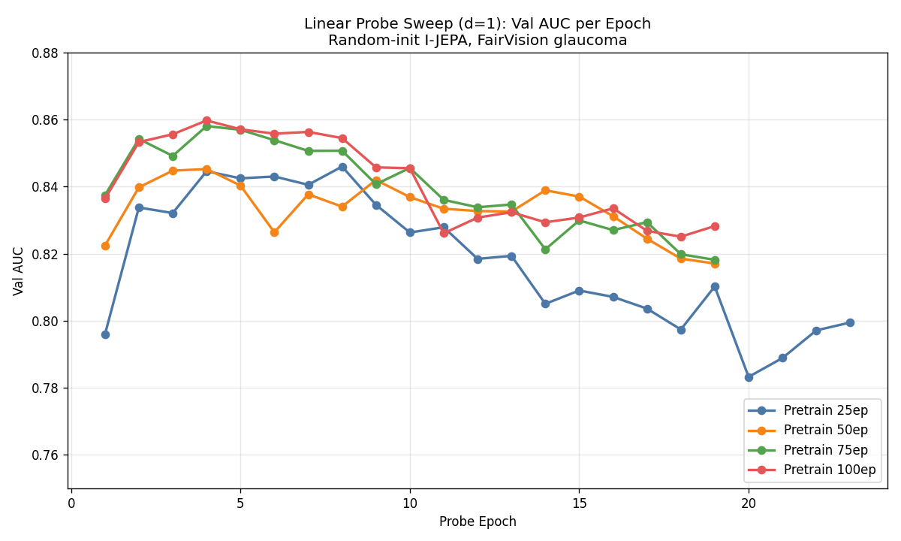
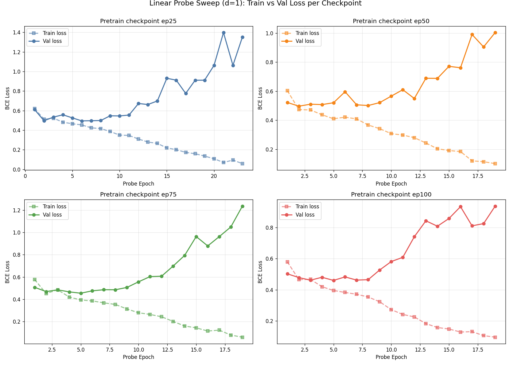

# I-JEPA for FairVision OCT Glaucoma Classification

Self-supervised pretraining using [I-JEPA](https://github.com/facebookresearch/ijepa) (Assran et al., CVPR 2023) on [Harvard FairVision](https://github.com/Harvard-Ophthalmology-AI-Lab/FairVision) OCT data for binary glaucoma classification on 3D volumes.

## Current Status

| Method | Encoder Init | Encoder | Slices | Probe | Val AUC | Test AUC |
|---|---|---|---|---|---|---|
| Frozen linear probe (d=1) | Random → I-JEPA ep100 | ViT-B/16 frozen | 100 | AttentiveProbe d=1 + Linear | **0.860** | **0.871** |
| Fine-tune + LLRD γ=0.65 | Random → I-JEPA ep100 | ViT-B/16 unfrozen | 64 | AttentiveProbe d=1 + Linear | — | — (running) |

Full sweep across ep25/50/75/100 in [frozen probe sweep doc](docs/experiments/downstream/frozen/random_posfix_d1_sweep.md).

### Frozen probe sweep (ep25 → ep100)

Test AUC improves monotonically with pretraining length. ep100 wins on both Val and Test; +0.015 AUC from ep25 to ep100.




Train vs val loss per checkpoint (overfit dynamics visible — expected for attentive probes on small medical data; see [lessons_learned.md](docs/lessons_learned.md) #10):



### Pretraining diagnostics (random-init, 100 epochs)

All four I-JEPA health metrics in one grid. Loss goes UP as the EMA target learns harder representations — this is expected. Quality signals are `rep_diversity` (stable 0.20-0.27, not collapsed) and `cos_sim` (stable 0.78-0.87, healthy predictor tracking).


## Quick Links

| | |
|---|---|
| **Experiments** | [All experiments](docs/experiments) |
| **Pretraining** | [Random-init 100ep run](docs/experiments/pretraining/run6_random_posfix.md) |
| **Frozen probe** | [d=1 sweep ep25/50/75/100](docs/experiments/downstream/frozen/random_posfix_d1_sweep.md) |
| **Fine-tune** | [LLRD fine-tune on ep100](docs/experiments/downstream/unfrozen) |
| **Architecture** | [Model architecture](docs/architecture.md) |
| **Lessons learned** | [Mistakes & fixes log](docs/lessons_learned.md) |
| **Research log** | [Problem/solution + paper references](docs/research_log.md) |

## Approach

Patch-level I-JEPA applied to individual 256×256 OCT slices (600K slices from 6K Training volumes × 100 slices per volume). The encoder learns within-slice spatial features by predicting masked patch representations from context patches.

Downstream, we mean-pool patches within each slice, aggregate 100 slice tokens with a literature-aligned **AttentiveProbe d=1** (~7M params, I-JEPA paper convention), then a LinearHead produces the binary glaucoma logit. Fine-tuning uses MAE-style Layer-wise LR Decay (γ=0.65).

See [architecture.md](docs/architecture.md) for full spec.

## Dataset

Harvard FairVision Glaucoma subset: 10,000 subjects (6K train / 1K val / 3K test), each with 200×200×200 OCT B-scan volume. Binary label: glaucoma (1) vs not (0). Available on [HuggingFace](https://huggingface.co/datasets/ming0100/Harvard_FairVision).

## Project Structure

```
src/
  models/vision_transformer.py     ViT encoder + predictor (I-JEPA)
  models/attentive_pool_minimal.py CrossAttnPool — minimal cross-attention probe (~280K)
  masks/multiblock.py              2D block masking for patch-level I-JEPA
  datasets/oct_slices.py           Per-slice dataset for SSL pretraining
  datasets/oct_volumes.py          Per-volume dataset for downstream eval
  utils/schedulers.py              Warmup-cosine LR, cosine WD
  train_patch.py                   I-JEPA pretraining entry point
  eval_downstream.py               Downstream frozen probe + fine-tune

configs/                           YAML configs (AML configs are local-only)
scripts/                           Shell scripts for AML job entry points
docs/
  architecture.md                  Model architecture
  lessons_learned.md               Mistakes & fixes
  research_log.md                  Chronological problem/solution log + paper bibliography
  experiments/
    pretraining/                   Pretraining run docs
    downstream/frozen/             Frozen probe sweep docs
    downstream/unfrozen/           Fine-tune docs
results/                           Training curves, AUC plots, raw CSVs
```

## Roadmap

- **Phase 1 (done)** — Random-init I-JEPA SSL on 600K OCT slices + d=1 frozen probe sweep (completed, ep100 winner)
- **Phase 1.5 (running)** — Fine-tune ep100 with MAE-style LLRD
- **Phase 2 (next)** — Baselines: DINOv3-ViT-B/16 + RETFound-DINOv2 frozen probes on our FairVision test split for apples-to-apples comparison
- **Phase 3** — DINO-init → I-JEPA continued pretraining on FairVision; direct vs-RETFound-DINOv2 comparison
- **Phase 4** — 3D-aware SSL (multi-view / axial)

See [research_log.md](docs/research_log.md) for the full backlog.

## References

- Assran et al., *Self-Supervised Learning from Images with a Joint-Embedding Predictive Architecture*, CVPR 2023. [arxiv 2301.08243](https://arxiv.org/abs/2301.08243) · [code](https://github.com/facebookresearch/ijepa)
- Bardes et al., *V-JEPA: Revisiting Feature Prediction for Learning Visual Representations from Video*, 2024. [arxiv 2404.08471](https://arxiv.org/html/2404.08471v1)
- Zhou et al., *Generalist versus Specialist Vision Foundation Models for Ocular Disease and Oculomics*, 2025. [arxiv 2509.03421](https://arxiv.org/abs/2509.03421v1)
- Zhou et al., *A foundation model for generalizable disease detection from retinal images* (RETFound), Nature 2023. [paper](https://www.nature.com/articles/s41586-023-06555-x)
- Oquab et al., *DINOv2: Learning Robust Visual Features without Supervision*, 2023. [arxiv 2304.07193](https://arxiv.org/abs/2304.07193)
- DINOv3 (Meta, 2025). [arxiv 2508.10104](https://arxiv.org/html/2508.10104v1)
- Kakogeorgiou et al., *Attention, Please! Revisiting Attentive Probing for Masked Image Modeling*, ICLR 2026. [arxiv 2506.10178](https://arxiv.org/abs/2506.10178)
- Luo et al., *FairVision: Equitable Deep Learning for Eye Disease Screening via Fair Identity Scaling*, 2024. [arxiv 2310.02492](https://arxiv.org/abs/2310.02492)

Full bibliography with context: [docs/research_log.md](docs/research_log.md#paper-bibliography).
