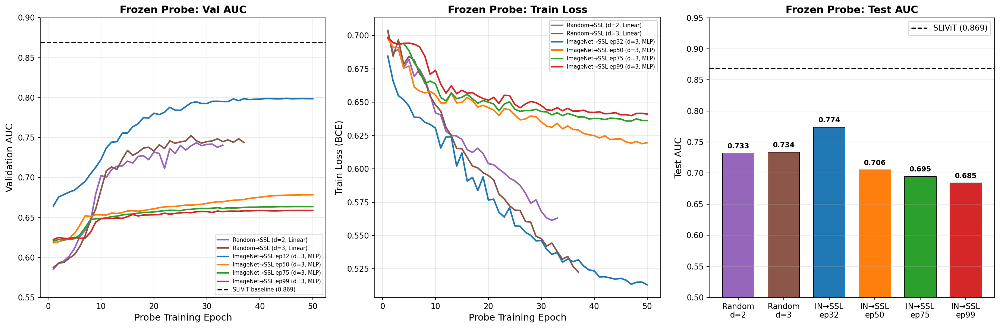

# I-JEPA for FairVision OCT Glaucoma Classification

Self-supervised pretraining using [I-JEPA](https://github.com/facebookresearch/ijepa) (Assran et al., CVPR 2023) on [Harvard FairVision](https://github.com/Harvard-Ophthalmology-AI-Lab/FairVision) OCT data for binary glaucoma classification. Builds on our SLIViT reproduction in [SliViT_3D_OCT_Glaucoma](https://github.com/yfeng0206/SliViT_3D_OCT_Glaucoma).

## Results Summary

| Method | Encoder Init | Encoder | Slices | Probe | Head | Val AUC | Test AUC |
|--------|-------------|---------|--------|-------|------|---------|----------|
| **SLIViT baseline** | Kermany OCT | ConvNeXt+ViT | 32 | 5-layer ViT | Linear | ~0.87 | **0.869** |
| I-JEPA frozen d=2 | Random→SSL ep11 | ViT-B/16 frozen | 100 | 2 blocks | Linear | 0.744 | 0.733 |
| I-JEPA frozen d=3 | Random→SSL ep11 | ViT-B/16 frozen | 100 | 3 blocks | Linear | 0.752 | 0.734 |
| **I-JEPA frozen d=3** | **ImageNet→SSL ep32** | **ViT-B/16 frozen** | **100** | **3 blocks** | **MLP** | **0.799** | **0.774** |
| I-JEPA frozen d=3 | ImageNet→SSL ep50 | ViT-B/16 frozen | 100 | 3 blocks | MLP | 0.679 | 0.706 |
| I-JEPA frozen d=3 | ImageNet→SSL ep75 | ViT-B/16 frozen | 100 | 3 blocks | MLP | 0.664 | 0.695 |
| I-JEPA frozen d=3 | ImageNet→SSL ep99 | ViT-B/16 frozen | 100 | 3 blocks | MLP | 0.659 | 0.685 |
| I-JEPA unfrozen d=2 | Random→SSL ep11 | ViT-B/16 fine-tune | 32 | 2 blocks | Linear | 0.819 | pending |
| I-JEPA unfrozen d=3 | Random→SSL ep11 | ViT-B/16 fine-tune | 64 | 3 blocks | Linear | 0.815 | pending |
| I-JEPA unfrozen d=2 | ImageNet→SSL ep32 | ViT-B/16 fine-tune | 32 | 2 blocks | MLP | running | pending |
| I-JEPA unfrozen d=2 | ImageNet→SSL ep32 | ViT-B/16 fine-tune | 64 | 2 blocks | MLP | running | pending |
| I-JEPA unfrozen d=3 | ImageNet→SSL ep32 | ViT-B/16 fine-tune | 32 | 3 blocks | MLP | running | pending |
| I-JEPA unfrozen d=3 | ImageNet→SSL ep32 | ViT-B/16 fine-tune | 64 | 3 blocks | MLP | running | pending |



## Key Findings

1. **ImageNet init helps frozen probe** (+4%): 0.774 (ImageNet→SSL ep32) vs 0.734 (Random→SSL), but only at early pretraining epochs.

2. **I-JEPA pretraining degrades ImageNet features over time**: Test AUC drops 0.774 → 0.685 from ep32 to ep99. The self-supervised objective overwrites useful ImageNet features with low-level patch prediction features that are less relevant to glaucoma.

3. **Fine-tuning is the key lever**: Unfreezing the encoder gives +8.5% AUC (0.734 → 0.819), confirming that task-specific adaptation matters more than better pretraining.

4. **Probe depth has minimal effect when frozen**: d=2 (0.733) vs d=3 (0.734). The frozen encoder features are the bottleneck, not probe capacity.


## Quick Links

| | |
|---|---|
| **Experiments** | [All experiments](docs/experiments) |
| **Pretraining** | [Pretraining runs](docs/experiments/pretraining) (Random-init, ImageNet-init, loss curves) |
| **Frozen Probe** | [Frozen probe eval](docs/experiments/downstream/frozen) (6 runs: Random vs ImageNet, multiple epochs) |
| **Fine-tuning** | [Unfrozen encoder eval](docs/experiments/downstream/unfrozen) (6 runs: d=2/3, 32/64 slices) |
| **Architecture** | [Model architecture details](docs/architecture.md) |
| **Lessons Learned** | [Mistakes & fixes log](docs/lessons_learned.md) |

## Motivation

Our SLIViT experiments reached 0.869 test AUC using a ConvNeXt feature extractor pretrained on Kermany OCT and a ViT integrator trained on 6K labeled FairVision volumes. Two bottlenecks limited further improvement: the ConvNeXt features were pretrained on a different task (not glaucoma), and the ViT integrator was trained from scratch on a small labeled dataset.

I-JEPA addresses both by learning representations directly from unlabeled OCT data through masked prediction in representation space. We implement two approaches, with patch-level as the primary approach.

### Patch-level I-JEPA (primary)

Standard I-JEPA applied to individual 256x256 OCT slices (600K images from 6K volumes x 100 slices). The encoder learns within-slice spatial features by predicting masked patch representations from context patches. See [architecture details](docs/architecture.md).

### Slice-level I-JEPA (failed)

I-JEPA applied to sequences of 32 ConvNeXt slice features per volume. Collapsed within 1-2 epochs due to insufficient token diversity (adjacent OCT slices produce nearly identical features). See [lessons learned](docs/lessons_learned.md).

## Dataset

Harvard FairVision Glaucoma subset: 10,000 subjects (6K train / 1K val / 3K test), each with 200x200x200 OCT B-scan volume. Binary labels: glaucoma (1) or not (0). Available on [HuggingFace](https://huggingface.co/datasets/ming0100/Harvard_FairVision).

## Project Structure

```
src/
  models/vision_transformer.py    # ViT encoder, predictor, slice-level variants
  masks/multiblock.py             # 2D block masking (patch-level)
  masks/slice_mask.py             # 1D contiguous masking (slice-level)
  datasets/oct_slices.py          # Individual slice dataset (600K images)
  datasets/oct_volumes.py         # Volume dataset (6K volumes)
  utils/schedulers.py             # Warmup cosine LR, cosine WD
  train_patch.py                  # Patch-level I-JEPA pretraining
  train_slice.py                  # Slice-level I-JEPA pretraining
  eval_downstream.py              # Downstream classification
  helper.py                       # Model init, optimizer, checkpoint I/O

configs/                          # AzureML job configs & training configs
scripts/                          # Entry point shell scripts
docs/
  experiments/                    # Detailed experiment logs & results
    pretraining/                  # Pretraining run details
    downstream/frozen/            # Frozen probe experiments
    downstream/unfrozen/          # Fine-tuning experiments
  architecture.md                 # Model architecture details
  lessons_learned.md              # Mistakes & fixes
results/                          # Training curves, plots, raw data
```

## References

- Assran et al., "Self-Supervised Learning from Images with a Joint-Embedding Predictive Architecture" ([paper](https://arxiv.org/abs/2301.08243), [code](https://github.com/facebookresearch/ijepa))
- Avram et al., "SLIViT: a general AI framework for clinical-feature diagnosis from limited 3D biomedical-imaging data" ([paper](https://pubmed.ncbi.nlm.nih.gov/38045283/), [code](https://github.com/cozygene/SLIViT))
- Luo et al., "Harvard Ophthalmology AI-Lab FairVision Dataset" ([paper](https://arxiv.org/abs/2310.02492), [code](https://github.com/Harvard-Ophthalmology-AI-Lab/FairVision))
