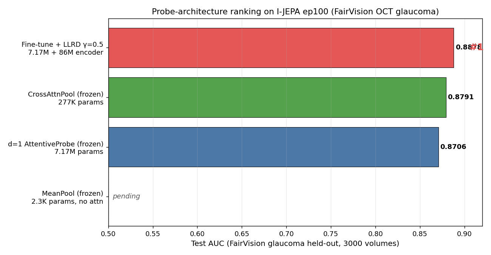

# I-JEPA for FairVision OCT Glaucoma Classification

Self-supervised pretraining using [I-JEPA](https://github.com/facebookresearch/ijepa) (Assran et al., CVPR 2023) on [Harvard FairVision](https://github.com/Harvard-Ophthalmology-AI-Lab/FairVision) OCT data, evaluated via frozen probe + fine-tune on binary glaucoma classification.

## Headline results

All on FairVision glaucoma held-out test split (3000 volumes). Encoder: random-init I-JEPA ViT-B/16, 100 epochs SSL on 600K OCT slices.

| Method | Probe | Params (trainable) | **Test AUC** |
|---|---|---|---|
| Frozen probe | MeanPool + Linear (no attention, no pos) | 2.3K | 0.8746 |
| Frozen probe | AttentiveProbe d=1 + Linear | 7.17M | 0.8706 |
| Frozen probe | **CrossAttnPool + Linear** | **277K** | **0.8791** |
| **Fine-tune + LLRD γ=0.5** | AttentiveProbe d=1 + Linear | 7.17M + 86M encoder | **0.8878** |

Best model: **fine-tune with MAE-style LLRD**. +0.009 Test AUC over best frozen probe (CrossAttnPool) — within Zhou 2025's 2-4% fine-tune-vs-LP gap range for retinal tasks.

**Ablation findings** (paired bootstrap, 95% CI, B=2000):
- **CrossAttnPool (277K) beats d=1 AttentiveProbe (7.17M) significantly** (+0.009, p=0.002). Confirms "Attention, Please!" (ICLR 2026): standard attentive probes are over-parameterized.
- **Mean-pool is within statistical noise of d=1** (+0.004, p=0.08, **ns**). d=1 fails to improve over mean-pool at 3000× more params — strong evidence of over-parameterization without AUC gain.
- **Attention with position still adds measurable signal** (CrossAttnPool − MeanPool = +0.005, p=0.04). Real but small.
- **Fine-tune decisively beats all frozen probes** (+0.009 vs CrossAttnPool, p=0.001; +0.017 vs d=1, p<0.001).

Full analysis: [`docs/experiments/frozen/ablation_analysis.md`](docs/experiments/frozen/ablation_analysis.md).

Queued:
- **Fine-tune + CrossAttnPool + LLRD** — submitted after MeanPool finished. Tests whether the 277K probe beats d=1-attn under fine-tuning as it did under frozen eval.

Pretraining-epoch sweep (ep25/50/75/100) lives at [`docs/experiments/frozen/d1_sweep.md`](docs/experiments/frozen/d1_sweep.md).

## Method

- **Pretraining**: I-JEPA on 256×256 OCT slices (FairVision Training split, 600K slices). ViT-B/16, 100 epochs, peak LR 0.00025, EMA 0.996→1.0, effective batch 512.
- **Downstream input**: Frozen ViT encodes each slice, patches mean-pooled within slice → per-slice 768-dim token. 100 slices per volume.
- **Slice-aggregation probe**: CrossAttnPool (learnable query, single-head cross-attention head_dim=64, slice-axis pos_embed) OR AttentiveProbe d=1 (I-JEPA paper style).
- **Fine-tune**: LLRD γ=0.5 with base LR 2e-4, 50 epochs planned / early-stopped by patience=15.

See [`docs/architecture.md`](docs/architecture.md) for the full spec.

## Dataset

Harvard FairVision Glaucoma subset: 10,000 subjects (6K Train / 1K Val / 3K Test), each with a 200×200×200 OCT B-scan volume. Binary label glaucoma/not. ~48.5% positive prevalence — balanced. Available on [HuggingFace](https://huggingface.co/datasets/ming0100/Harvard_FairVision).

## Roadmap

- Phase 1 (done): Random-init I-JEPA SSL → frozen probe + fine-tune evaluation
- Phase 2 (in progress): Probe architecture ablations (CrossAttnPool done; MeanPool running)
- Phase 3 (planned): DINO-init continuation (DINOv2 or DINOv3) + fine-tune
- Phase 4 (planned): 3D-aware SSL extension (multi-view / axial)

Details and backlog: [`docs/research_log.md`](docs/research_log.md).

## Links

| | |
|---|---|
| Pretraining | [`docs/experiments/pretraining`](docs/experiments/pretraining) |
| Frozen probe (d=1, CrossAttnPool, MeanPool) | [`docs/experiments/frozen`](docs/experiments/frozen) |
| Fine-tune (LLRD on d=1) | [`docs/experiments/finetune`](docs/experiments/finetune) |
| Model architecture | [`docs/architecture.md`](docs/architecture.md) |
| Lessons learned | [`docs/lessons_learned.md`](docs/lessons_learned.md) |
| Research log + paper bibliography | [`docs/research_log.md`](docs/research_log.md) |

## References

- Assran et al., *Self-Supervised Learning from Images with a Joint-Embedding Predictive Architecture* (I-JEPA), CVPR 2023. [arxiv 2301.08243](https://arxiv.org/abs/2301.08243)
- Bardes et al., *V-JEPA: Revisiting Feature Prediction for Learning Visual Representations from Video*, 2024. [arxiv 2404.08471](https://arxiv.org/html/2404.08471v1)
- Zhou et al., *Generalist vs Specialist Vision Foundation Models for Ocular Disease and Oculomics*, 2025. [arxiv 2509.03421](https://arxiv.org/abs/2509.03421v1)
- Zhou et al., *A Foundation Model for Generalizable Disease Detection from Retinal Images* (RETFound), Nature 2023. [paper](https://www.nature.com/articles/s41586-023-06555-x)
- Kakogeorgiou et al., *Attention, Please! Revisiting Attentive Probing for Masked Image Modeling*, ICLR 2026. [arxiv 2506.10178](https://arxiv.org/abs/2506.10178)
- Luo et al., *FairVision: Equitable Deep Learning for Eye Disease Screening*, 2024. [arxiv 2310.02492](https://arxiv.org/abs/2310.02492)

Full bibliography with context: [`docs/research_log.md`](docs/research_log.md#paper-bibliography).
