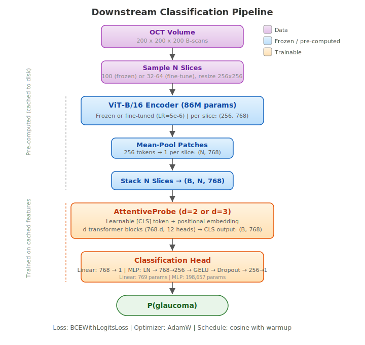

# Model Architecture

Detailed architecture for I-JEPA applied to FairVision OCT glaucoma classification. The project uses two levels of I-JEPA (patch-level as primary, slice-level as failed experiment) and a downstream classification pipeline.

## 1. Patch-Level I-JEPA Architecture

Standard I-JEPA applied to individual 256x256 OCT slices. The encoder learns within-slice spatial features by predicting masked patch representations from context patches.

### Encoder (Context Encoder)

| Component | Detail |
|-----------|--------|
| Architecture | ViT-B/16 (VisionTransformer) |
| Image size | 256 x 256 |
| Patch size | 16 x 16 |
| Grid size | 16 x 16 = 256 patches |
| Embed dim | 768 |
| Depth | 12 transformer blocks |
| Attention heads | 12 (head dim = 64) |
| MLP ratio | 4.0 (hidden dim = 3072) |
| QKV bias | True |
| Positional embedding | Fixed 2D sinusoidal (not learned), no CLS token |
| Norm layer | LayerNorm (eps=1e-5, PyTorch default) |
| Drop path | 0.0 (linearly increasing schedule available) |
| Weight init | Truncated normal (std=0.02) + DeepNorm rescaling |
| Parameters | ~86M |

### Target Encoder

| Component | Detail |
|-----------|--------|
| Architecture | Identical to context encoder |
| Update rule | Exponential Moving Average (EMA) of context encoder |
| EMA schedule | Cosine from 0.996 to 1.0 over training |
| Gradient | None (no backward pass, runs in fp32 without autocast) |
| Parameters | ~86M (not counted in trainable params) |

### Predictor

| Component | Detail |
|-----------|--------|
| Architecture | VisionTransformerPredictor |
| Input dim | 768 (from encoder) |
| Predictor embed dim | 384 |
| Depth | 6 transformer blocks |
| Attention heads | 12 (head dim = 32) |
| MLP ratio | 4.0 (hidden dim = 1536) |
| Positional embedding | Fixed 2D sinusoidal (same grid as encoder) |
| Mask token | Learnable, 1 x 384 |
| Input projection | Linear(768, 384) |
| Output projection | Linear(384, 768) |
| Parameters | ~22M |

### Patch Embedding

| Component | Detail |
|-----------|--------|
| Implementation | Conv2d(in_chans, 768, kernel=16, stride=16) |
| Input | (B, 3, 256, 256) -- OCT slices are grayscale replicated to 3 channels |
| Output | (B, 256, 768) -- 16x16 grid of 768-dim patch tokens |

### Positional Embedding

| Component | Detail |
|-----------|--------|
| Type | Fixed 2D sinusoidal (not learned) |
| CLS token | None -- direct pos_embed addition (cleaner than official I-JEPA) |
| Shape | (1, 256, 768) for encoder; (1, 256, 384) for predictor |
| Added at | After patch embedding, before masking |

### Masking Strategy

| Parameter | Value |
|-----------|-------|
| Context mask (encoder input) | 1 large block, scale [0.85, 1.0] of patches |
| Target masks (prediction targets) | 4 small blocks, scale [0.15, 0.2] of patches |
| Aspect ratio | [0.75, 1.5] |
| Allow overlap | False |
| Min keep | 10 patches |

The encoder sees 85-100% of patches (context). The predictor must predict representations at 4 small target regions (each 15-20% of patches) using only the context tokens. This is the standard I-JEPA masking strategy.

## 2. Slice-Level I-JEPA Architecture (Failed)

I-JEPA applied to sequences of ConvNeXt slice features per volume. Collapsed within 1-2 epochs due to insufficient token diversity (adjacent OCT slices produce nearly identical ConvNeXt features).

### Slice Encoder

| Component | Detail |
|-----------|--------|
| Architecture | SliceEncoder (transformer, no patch embedding) |
| Input | (B, 32, 768) -- pre-computed ConvNeXt features |
| Num slices | 32 |
| Embed dim | 768 |
| Depth | 12 transformer blocks |
| Attention heads | 12 |
| Positional embedding | Fixed 1D sinusoidal |

### Slice Predictor

| Component | Detail |
|-----------|--------|
| Architecture | SlicePredictor |
| Predictor embed dim | 384 |
| Depth | 6 transformer blocks |
| Positional embedding | Fixed 1D sinusoidal |
| Mask token | Learnable, 1 x 384 |

### Why It Failed

Adjacent OCT slices produce nearly identical ConvNeXt features (cosine similarity >0.98). With only 32 tokens and high inter-token similarity, the prediction task is trivially solvable and the encoder collapses to constant outputs. See [lessons learned](lessons_learned.md) for details.

## 3. Downstream Classifier Architecture

### Frozen Probe Pipeline



### AttentiveProbe (default)

Full self-attention over [CLS, s1..s100] with FFN. One block (d=1) — matches I-JEPA paper convention.

| Component | Detail |
|---|---|
| Architecture | Transformer block(s) with learnable CLS token |
| CLS token | Learnable, 1 × 768 |
| Positional embedding | Learnable, (N+1) × 768 |
| Depth | 1 block (literature-aligned default) |
| Attention heads | 12 |
| MLP ratio | 4.0 |
| Final norm | LayerNorm |
| Output | CLS token after final norm → (B, 768) |
| Parameters (d=1) | ~7.17M |

### CrossAttnPool (minimal ablation alternative)

Single learnable query, single-head cross-attention (head_dim=64), no FFN, no self-attention between slices. Slice-axis positional embedding preserves axial order (needed because per-slice features are mean-pooled before the probe, so slice order is not in the feature values). ~26× smaller than AttentiveProbe d=1 while preserving attention-based slice weighting and axial position info. Implemented in `src/models/attentive_pool_minimal.py`.

| Component | Detail |
|---|---|
| Query tokens | 1 learnable (1 × 768) |
| Positional embedding | Learnable, S × 768 |
| Q / K / V projection | Linear(768 → 64) |
| Attention | Single-head, softmax(QK/√64) |
| Output projection | Linear(64 → 768) |
| Final norm | LayerNorm(768) |
| Parameters | ~277K |

### Classification Head

Only LinearHead is in active use. (MLPHead code exists but is not part of the current protocol.)

**LinearHead:**

| Component | Detail |
|---|---|
| Layers | LayerNorm(768) → Linear(768, 1) |
| Parameters | 2,305 |

### Training Configurations

**Frozen probe (encoder frozen):**

| Parameter | Value |
|---|---|
| Encoder | Frozen (no gradients) |
| Slices | 100 |
| Batch size | 256 |
| Probe LR = Head LR | 4e-4 (single LR, linear-scaled from 1e-3 @ bs=1024) |
| Epochs / Patience | 50 / 15 |
| Warmup | 5 epochs |
| Weight decay | 0.05 |
| Dropout (probe) | 0.2 |
| Features | Pre-computed once and cached |

**Fine-tuning (encoder unfrozen, MAE-style LLRD):**

| Parameter | Value |
|---|---|
| Encoder | Unfrozen with layer-wise LR decay |
| LLRD γ | 0.65 (ViT-B standard) |
| Base LR | 4e-4 (probe, head, encoder.norm) |
| Effective per-layer LR | embed 1.48e-6 → top block 2.60e-4 → head 4e-4 |
| Slices | 64 (100 OOMs with encoder gradients on T4 16GB) |
| Batch size / GPU | 1 |
| Gradient accumulation | 4 |
| Effective batch size | 16 (1 × 4 GPUs × 4 accum) |
| Epochs / Patience | 50 / 15 (gated on past_warmup) |
| Warmup | 10 epochs |
| Weight decay | 0.05 |
| Dropout (probe) | 0.2 |
| LR schedule | Cosine with warmup |
| AMP | fp16 autocast |
| GPUs | 4× T4 16 GB (DDP) |

## 4. Comparison with Original I-JEPA

| Aspect | Official I-JEPA | Ours |
|--------|----------------|------|
| Input domain | ImageNet (224x224, color) | OCT slices (256x256, grayscale->3ch) |
| Encoder | ViT-B/16 to ViT-H/14 | ViT-B/16 only |
| Patch grid | 14x14 = 196 patches | 16x16 = 256 patches |
| Predictor | 6 blocks, dim=384 | 6 blocks, dim=384 (same) |
| Batch size | 2048 (256 GPUs) | 512 effective (4 GPUs x 64 x accum 2) |
| Epochs | 300-600 | 100 (dataset is smaller) |
| Augmentation | RandomResizedCrop only | RandomResizedCrop only (same) |
| Momentum schedule | Linear | Cosine (negligible difference for 0.996->1.0) |
| Target path AMP | Under autocast | Without autocast (fp32, slightly more precise) |
| LayerNorm epsilon | 1e-6 | 1e-5 (PyTorch default) |
| qkv_bias default | False (True in practice) | True |
| CLS token | Has interpolation code (buggy for no-CLS) | Direct pos_embed add (cleaner) |
| Pretrained init | Not supported | Custom loading path with shape-mismatch handling |
| Downstream eval | AttentiveProbe (1 block) on ImageNet patches | AttentiveProbe (1 block, d=1) on OCT volume slices |

Key differences explained:

- **Patch grid 256 vs 196**: Our 256x256 images with 16x16 patches yield 16x16=256 patches vs ImageNet's 224/16=14x14=196. More patches means more context for masked prediction.
- **Cosine vs linear momentum**: For EMA range [0.996, 1.0], the max difference between cosine and linear is ~0.0003. Negligible.
- **Target path fp32**: We intentionally run the target encoder without autocast for slightly more precise target representations. No backward pass is needed on the target path, so the memory cost is minimal.
- **Probe depth**: The I-JEPA paper uses 1 block; we follow that convention after confirming deeper probes (d=3 at 21M params) give no AUC gain over d=1 (7M) on this dataset — the encoder, not the probe, is the bottleneck.

## 5. Memory Budget

### Pretraining (per GPU, T4 16 GB)

| Component | Memory |
|-----------|--------|
| Encoder parameters (fp32) | ~330 MB |
| Target encoder parameters (fp32) | ~330 MB |
| Predictor parameters (fp32) | ~85 MB |
| Optimizer states (AdamW, 2x params) | ~830 MB |
| Activations (batch=64, 256 patches, AMP) | ~4-6 GB |
| Gradients | ~415 MB |
| CUDA overhead + fragmentation | ~2-3 GB |
| **Total** | **~8-11 GB** |

### Frozen Downstream (per GPU, T4 16 GB)

| Component | Memory |
|-----------|--------|
| Encoder parameters (fp32, no grad) | ~330 MB |
| Cached features (100 slices x 768, batch=64) | ~20 MB |
| Probe parameters + optimizer | ~120 MB |
| Activations (probe only, AMP) | ~500 MB |
| **Total** | **~1-2 GB** |

Feature extraction is done in chunks (encode_chunk_size=50) to avoid OOM. Features are cached as tensors for training.

### Fine-tune Downstream (per GPU, T4 16 GB)

| Component | Memory |
|-----------|--------|
| Encoder parameters (fp32) | ~330 MB |
| Encoder gradients | ~330 MB |
| Encoder optimizer states (AdamW) | ~660 MB |
| Slice activations (32 slices, with grad) | ~3.8 GB (32 x ~120 MB) |
| Slice activations (64 slices, with grad) | ~7.7 GB (64 x ~120 MB) |
| Probe + head parameters + optimizer | ~200 MB |
| CUDA overhead | ~2 GB |
| **Total (32 slices)** | **~7.3 GB** |
| **Total (64 slices)** | **~11.2 GB** |

100 slices with encoder gradients exceeds 15 GB and OOMs on T4 16 GB. The practical maximum is ~64 slices at batch_size=1.

## 6. Training Time Estimates

### Pretraining

| Config | GPUs | Batch/GPU | Eff Batch | Time/Epoch | Total (100 ep) |
|--------|------|-----------|-----------|------------|-----------------|
| ViT-B/16, 600K slices | 4x T4 | 64 | 512 | ~35 min | ~58 hours |

### Downstream

| Config | GPUs | Batch/GPU | Eff Batch | Time/Epoch | Total |
|--------|------|-----------|-----------|------------|-------|
| Frozen probe, 100 slices | 4x T4 | 64 | 64 | ~2 min (after feature caching) | ~10 min (feature cache) + ~1.5 hr (50 ep) |
| Fine-tune, 32 slices | 4x T4 | 1 | 16 | ~15 min | ~6 hr (25 ep) |
| Fine-tune, 64 slices | 4x T4 | 1 | 16 | ~25 min | ~10 hr (25 ep) |

## 7. Training Details

### Loss Function

Smooth L1 loss (Huber loss) between predicted and target patch representations:

```
loss = F.smooth_l1_loss(predicted_patches, target_patches)
```

Computed only at target (masked) positions. The predictor output is projected back to encoder dimension (768) before computing loss against the target encoder's output at the same positions.

### EMA Target Encoder

The target encoder is an exponential moving average of the context encoder, updated after each optimizer step:

```
target_params = ema * target_params + (1 - ema) * encoder_params
```

The EMA coefficient follows a cosine schedule from 0.996 to 1.0 over training. Early in training, the target updates quickly (ema=0.996, ~0.4% of encoder per step). Late in training, the target is nearly frozen (ema~1.0).

Important: EMA updates must be synchronized with the optimizer step, not with every micro-batch. With gradient accumulation of 2, the EMA updates every 2 micro-batches.

### Optimizer

| Parameter | Pretraining | Downstream (frozen) | Downstream (fine-tune) |
|-----------|-------------|--------------------|-----------------------|
| Optimizer | AdamW | AdamW | AdamW |
| Peak LR | 0.00025 | 1e-4 (probe) / 1e-3 (head) | 5e-6 (enc) / 1e-4 (probe) / 1e-3 (head) |
| Start LR | 0.0001 | 0 (warmup from 0) | 0 (warmup from 0) |
| Final LR | 1e-6 | cosine to 0 | cosine to 0 |
| Weight decay | 0.04 -> 0.4 (cosine) | 0.01 | 0.01 |
| Warmup | 15 epochs (pretraining) | 3 epochs | 3 epochs |
| Schedule | Warmup cosine | Warmup cosine | Warmup cosine |

For pretraining, 0.00025 is the proven peak LR for OCT data with ViT-B/16 and effective batch=512. The original I-JEPA paper uses 0.0005 for ImageNet, but OCT's lower diversity produces more correlated gradients, requiring a lower LR.

### Masking Strategy

I-JEPA uses asymmetric masking: the encoder sees a large context region (85-100% of patches), and the predictor must predict representations at multiple small target regions (each 15-20% of patches).

This differs from MAE which reconstructs pixels at masked positions. I-JEPA predicts in representation space, which:
1. Avoids pixel-level noise sensitivity
2. Forces the encoder to learn semantic features (not texture)
3. Enables information-dense targets (representation vs raw pixels)

### Early Stopping

- **Pretraining**: No early stopping in the current protocol. Patience is technically supported (gated on `past_warmup` to avoid latching onto the artificially low pre-warmup loss from EMA initialization), but set to 999 in practice to disable it. Literature (RETFound, V-JEPA) uses fixed-epoch training.
- **Downstream**: Patience=5 on validation AUC. Early stopping is critical here because fine-tuning with small effective batch sizes (16) overfits quickly.

## 8. Code Differences from Official I-JEPA

These are intentional differences documented for reproducibility:

| Aspect | Official I-JEPA | Ours | Impact |
|--------|----------------|------|--------|
| Momentum schedule | Linear | Cosine | Negligible for EMA range [0.996, 1.0] |
| Target path AMP | Under autocast | Without autocast (fp32) | Slightly more precise targets |
| LayerNorm epsilon | 1e-6 | 1e-5 (PyTorch default) | Minor numerical difference |
| qkv_bias default | False | True | Both use True in practice for ViT-B |
| Pretrained init | Not supported | Custom loading with shape-mismatch skip | Novel capability for domain adaptation |
| CLS token | Has interpolation code (buggy for no-CLS) | Direct pos_embed addition | Cleaner, avoids the bug |
| Patch grid | 14x14 (224/16) | 16x16 (256/16) | 256 vs 196 patches |
| Downstream probe | 1 block, ImageNet classes | 1 block, volume-level binary classification | Same depth, different task |
| Gradient accumulation | None (large GPU fleet) | 2 (pretraining) or 4 (fine-tuning) | Needed for small GPU count |
| DDP early stop sync | N/A | Broadcast-based flag (no break in rank-specific blocks) | Avoids NCCL deadlocks |
| Blob uploads | N/A | Non-blocking background threads | Avoids NCCL timeouts from blocking I/O |
