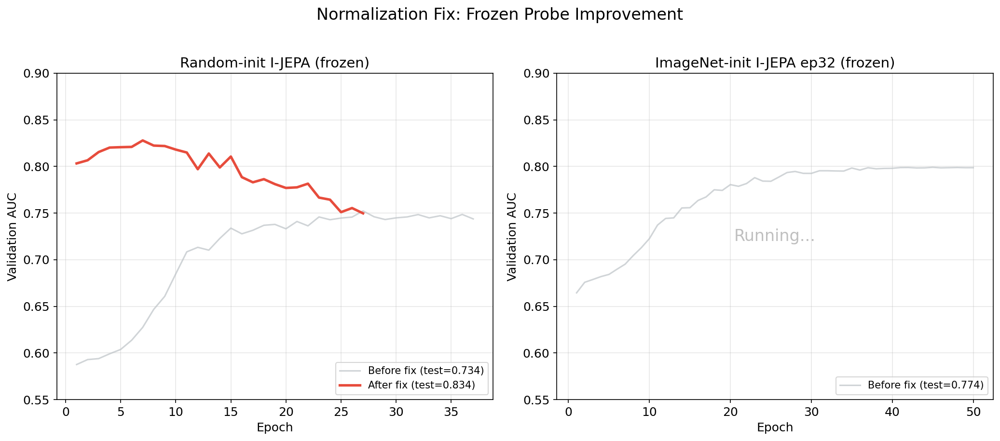
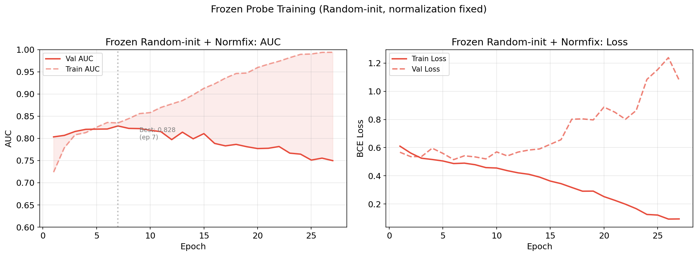

# Frozen Probe Downstream Experiments

## Approach

These experiments evaluate frozen I-JEPA ViT-B/16 encoders on OCT-based glaucoma classification using the FairVision dataset. The pipeline is: **frozen ViT-B/16 encoder** (no gradient) produces per-patch embeddings from each OCT slice, which are **mean-pooled** across slices, then fed through a learnable **AttentiveProbe** (multi-head cross-attention, configurable depth), and finally a **classification head** (linear or MLP) trained with **BCEWithLogitsLoss**. Only the probe and head parameters are updated during training; the encoder remains frozen throughout.

All runs use 100 OCT slices per eye, 256x256 crop size, patch size 16, batch size 64, and cosine LR schedule with 3-epoch warmup.

> **Important:** Early results (marked "old" below) had a normalization bug: the encoder was pretrained with ImageNet normalization but downstream fed raw [0,1] tensors. The corrected runs ("normfix") apply proper `imagenet_normalize()` before the frozen encoder. See [lessons learned](../../../lessons_learned.md#10-imagenet-normalization-mismatch-caused--10-auc-in-frozen-probe).

## Comparison Table

### Corrected Results (with ImageNet normalization)

| Run ID | Encoder Init | Probe Depth | Head Type | Slices | Val AUC | Test AUC | Sensitivity | Specificity |
|--------|-------------|-------------|-----------|--------|---------|----------|-------------|-------------|
| [**frozen_random_d3_normfix**](random_d3_normfix.md) | Random→SSL ep11 | 3 | mlp | 100 | **0.8279** | **0.8339** | 0.8274 | 0.6402 |
| frozen_imagenet_ep32_d3_normfix | ImageNet→SSL ep32 | 3 | mlp | 100 | -- | *pending* | -- | -- |

### Old Results (without normalization — for reference only)

| Run ID | Encoder Init | Probe Depth | Head Type | Slices | Val AUC | Test AUC |
|--------|-------------|-------------|-----------|--------|---------|----------|
| frozen_random_d2_s100 | Random→SSL ep11 | 2 | linear | 100 | 0.7435 | 0.7327 |
| frozen_random_d3_s100 | Random→SSL ep11 | 3 | linear | 100 | 0.7523 | 0.7341 |
| frozen_imagenet_ep32_d3_s100 | ImageNet→SSL ep32 | 3 | mlp | 100 | 0.7992 | 0.7742 |
| frozen_imagenet_ep50_d3_s100 | ImageNet→SSL ep50 | 3 | mlp | 100 | 0.6785 | 0.7058 |
| frozen_imagenet_ep75_d3_s100 | ImageNet→SSL ep75 | 3 | mlp | 100 | 0.6637 | 0.6950 |
| frozen_imagenet_ep99_d3_s100 | ImageNet→SSL ep99 | 3 | mlp | 100 | 0.6588 | 0.6847 |

## Comparison Plots

## Key Findings

1. **Normalization fix is critical (+10 AUC points):** Frozen Random-init went from 0.734 to **0.834** simply by applying ImageNet normalization at eval time. The encoder was pretrained with `T.Normalize(IMAGENET_MEAN, IMAGENET_STD)` but downstream evaluation was feeding raw [0,1] tensors.

2. **Frozen probe nearly matches fine-tuning:** The corrected frozen probe (0.834) is within 0.5% of the best unfrozen result (0.829), suggesting I-JEPA representations are strong enough without fine-tuning.

3. **I-JEPA pretraining degrades ImageNet features over time:** Test AUC drops from ep32 to ep99 for ImageNet-init (note: these old numbers are pre-normfix and will be updated).

4. **Sensitivity improved dramatically:** Corrected model has 82.7% sensitivity vs 63.1% pre-fix. The normalization fix improved detection of glaucoma cases, not just overall AUC.

5. **Best epoch is early (epoch 7):** The corrected run peaked at epoch 7 with val AUC 0.828, then overfit. Early stopping with patience=20 caught this at epoch 27.
