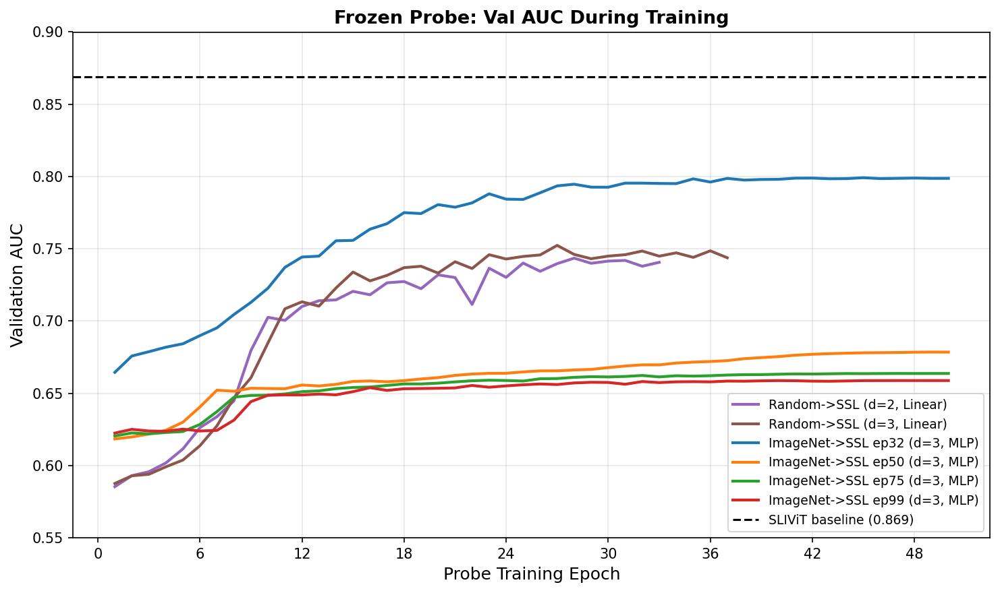
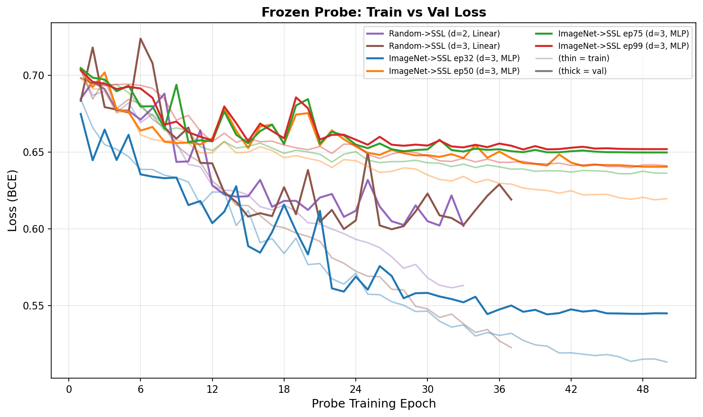
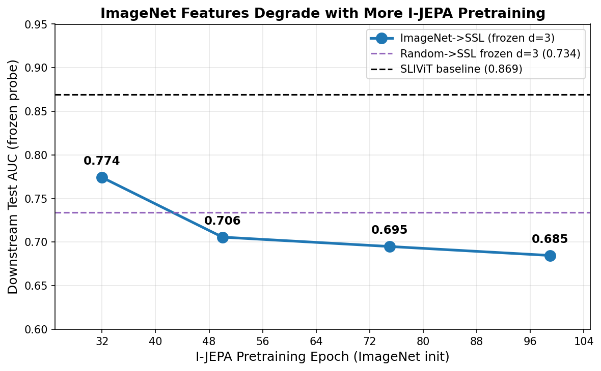

# Frozen Probe Downstream Experiments

## Approach

These experiments evaluate frozen I-JEPA ViT-B/16 encoders on OCT-based glaucoma classification using the FairVision dataset. The pipeline is: **frozen ViT-B/16 encoder** (no gradient) produces per-patch embeddings from each OCT slice, which are **mean-pooled** across slices, then fed through a learnable **AttentiveProbe** (multi-head cross-attention, configurable depth), and finally a **classification head** (linear or MLP) trained with **BCEWithLogitsLoss**. Only the probe and head parameters are updated during training; the encoder remains frozen throughout.

All runs use 100 OCT slices per eye, 256x256 crop size, patch size 16, batch size 64, and cosine LR schedule with 3-epoch warmup.

## Comparison Table

| Run ID | Encoder Checkpoint | Probe Depth | Head Type | Slices | Val AUC | Test AUC | Sensitivity | Specificity |
|--------|-------------------|-------------|-----------|--------|---------|----------|-------------|-------------|
| [frozen_imagenet_ep32_d3_s100](imagenet_ep32_d3_mlp.md) | jepa_patch-best (ep32) | 3 | mlp | 100 | 0.7992 | **0.7742** | 0.6310 | 0.7816 |
| [frozen_random_d3_s100](random_d3_linear.md) | jepa_patch-best (ep32) | 3 | linear | 100 | 0.7523 | 0.7341 | -- | -- |
| [frozen_random_d2_s100](random_d2_linear.md) | jepa_patch-best (ep32) | 2 | linear | 100 | 0.7435 | 0.7327 | -- | -- |
| [frozen_imagenet_ep50_d3_s100](imagenet_ep50_d3_mlp.md) | jepa_patch-ep50 | 3 | mlp | 100 | 0.6785 | 0.7058 | 0.5634 | 0.7471 |
| [frozen_imagenet_ep75_d3_s100](imagenet_ep75_d3_mlp.md) | jepa_patch-ep75 | 3 | mlp | 100 | 0.6637 | 0.6950 | 0.5969 | 0.7060 |
| [frozen_imagenet_ep99_d3_s100](imagenet_ep99_d3_mlp.md) | jepa_patch-latest (ep99) | 3 | mlp | 100 | 0.6588 | 0.6847 | 0.6030 | 0.6760 |

## Training Curves

### Val AUC During Training

### Train vs Val Loss

### Test AUC vs Pretraining Epoch

## Key Findings

1. **Best checkpoint is best:** The ep32 (best SSL) checkpoint substantially outperforms all later SSL epochs. Test AUC of 0.7742 (MLP head) vs. 0.7058 (ep50), 0.6950 (ep75), 0.6847 (ep99).

2. **Monotonic degradation with continued SSL training:** Downstream performance degrades steadily as SSL pre-training continues past epoch 32. Each subsequent checkpoint (ep50, ep75, ep99) performs worse, suggesting the encoder increasingly overfits to the ImageNet SSL objective and loses transferable features.

3. **MLP head outperforms linear head:** Comparing the ep32 checkpoint with probe depth 3, the MLP head (test AUC 0.7742) exceeds the linear head (test AUC 0.7341) by ~4 points, indicating the classification boundary benefits from nonlinearity.

4. **Deeper probe helps modestly:** With the linear head, increasing probe depth from 2 to 3 improved val AUC (0.7435 to 0.7523) and test AUC marginally (0.7327 to 0.7341).

5. **Sensitivity-specificity trade-off:** The best model (ep32 MLP) achieves 63.1% sensitivity and 78.2% specificity, indicating better performance at identifying healthy eyes than detecting glaucoma -- a limitation for clinical screening.
