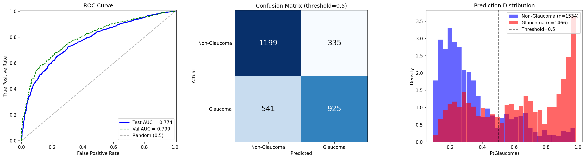

# Frozen Probe: ImageNet SSL ep32 (best), d=3, MLP

Run ID: `frozen_imagenet_ep32_d3_s100`

## Configuration

| Parameter | Value |
|-----------|-------|
| Mode | patch |
| Encoder | vit_base (ViT-B/16) |
| Encoder Checkpoint | jepa_patch-best.pth.tar (ep32) |
| Freeze Encoder | true |
| Probe Depth | 3 |
| Probe Num Heads | 12 |
| Head Type | mlp |
| Num Slices | 100 |
| Slice Size | 256 |
| Crop Size | 256 |
| Patch Size | 16 |
| Batch Size | 64 |
| Accum Steps | 4 |
| LR (probe) | 1e-4 |
| LR (head) | 1e-3 |
| LR (encoder) | 1e-6 (frozen, unused) |
| Weight Decay | 0.01 |
| Dropout | 0.1 |
| Epochs | 50 |
| Patience | 10 |
| Warmup Epochs | 3 |
| Seed | 42 |

## Results

| Metric | Value |
|--------|-------|
| Test AUC | 0.7742 |
| Val AUC (best) | 0.7992 |
| Test Loss | 0.5742 |
| Sensitivity | 0.6310 |
| Specificity | 0.7816 |
| Best Epoch | 45 |
| Probe Params | 21,343,488 |
| Head Params | 198,657 |

## Training Log

| Epoch | Train Loss | Train AUC | Val Loss | Val AUC | LR | Elapsed (s) |
|-------|-----------|-----------|----------|---------|-----|-------------|
| 1 | 0.6845 | 0.5763 | 0.6749 | 0.6645 | 3.33e-5 | 306.3 |
| 2 | 0.6659 | 0.6366 | 0.6447 | 0.6758 | 6.67e-5 | 302.1 |
| 3 | 0.6549 | 0.6594 | 0.6647 | 0.6788 | 1.00e-4 | 300.2 |
| 4 | 0.6518 | 0.6619 | 0.6449 | 0.6819 | 9.99e-5 | 301.4 |
| 5 | 0.6470 | 0.6715 | 0.6613 | 0.6843 | 9.96e-5 | 304.9 |
| 6 | 0.6387 | 0.6842 | 0.6355 | 0.6899 | 9.90e-5 | 297.7 |
| 7 | 0.6386 | 0.6863 | 0.6340 | 0.6953 | 9.82e-5 | 299.1 |
| 8 | 0.6350 | 0.6919 | 0.6330 | 0.7045 | 9.72e-5 | 300.5 |
| 9 | 0.6333 | 0.6935 | 0.6334 | 0.7129 | 9.60e-5 | 296.2 |
| 10 | 0.6306 | 0.6964 | 0.6154 | 0.7227 | 9.46e-5 | 295.9 |
| 11 | 0.6157 | 0.7160 | 0.6181 | 0.7372 | 9.30e-5 | 301.3 |
| 12 | 0.6239 | 0.7071 | 0.6036 | 0.7443 | 9.12e-5 | 301.8 |
| 13 | 0.6239 | 0.7096 | 0.6111 | 0.7449 | 8.92e-5 | 299.0 |
| 14 | 0.6021 | 0.7332 | 0.6277 | 0.7555 | 8.71e-5 | 306.3 |
| 15 | 0.6119 | 0.7238 | 0.5887 | 0.7558 | 8.48e-5 | 300.2 |
| 16 | 0.5909 | 0.7481 | 0.5844 | 0.7636 | 8.23e-5 | 299.5 |
| 17 | 0.5936 | 0.7422 | 0.5979 | 0.7674 | 7.97e-5 | 301.2 |
| 18 | 0.5838 | 0.7547 | 0.6158 | 0.7750 | 7.69e-5 | 301.2 |
| 19 | 0.5939 | 0.7434 | 0.5985 | 0.7744 | 7.40e-5 | 298.5 |
| 20 | 0.5766 | 0.7621 | 0.5833 | 0.7806 | 7.11e-5 | 294.6 |
| 21 | 0.5773 | 0.7611 | 0.6117 | 0.7788 | 6.80e-5 | 298.5 |
| 22 | 0.5675 | 0.7708 | 0.5612 | 0.7818 | 6.48e-5 | 298.5 |
| 23 | 0.5639 | 0.7736 | 0.5590 | 0.7880 | 6.16e-5 | 302.4 |
| 24 | 0.5709 | 0.7679 | 0.5688 | 0.7843 | 5.83e-5 | 300.1 |
| 25 | 0.5573 | 0.7800 | 0.5603 | 0.7842 | 5.50e-5 | 301.6 |
| 26 | 0.5570 | 0.7835 | 0.5757 | 0.7887 | 5.17e-5 | 306.1 |
| 27 | 0.5524 | 0.7861 | 0.5692 | 0.7935 | 4.83e-5 | 300.6 |
| 28 | 0.5501 | 0.7888 | 0.5547 | 0.7947 | 4.50e-5 | 296.6 |
| 29 | 0.5460 | 0.7930 | 0.5580 | 0.7927 | 4.17e-5 | 303.2 |
| 30 | 0.5463 | 0.7927 | 0.5582 | 0.7926 | 3.84e-5 | 300.1 |
| 31 | 0.5397 | 0.7980 | 0.5559 | 0.7954 | 3.52e-5 | 300.3 |
| 32 | 0.5359 | 0.8005 | 0.5542 | 0.7954 | 3.20e-5 | 298.9 |
| 33 | 0.5373 | 0.7994 | 0.5520 | 0.7952 | 2.90e-5 | 306.2 |
| 34 | 0.5301 | 0.8054 | 0.5557 | 0.7951 | 2.60e-5 | 299.4 |
| 35 | 0.5324 | 0.8040 | 0.5443 | 0.7984 | 2.31e-5 | 306.3 |
| 36 | 0.5305 | 0.8055 | 0.5474 | 0.7962 | 2.03e-5 | 302.5 |
| 37 | 0.5318 | 0.8033 | 0.5500 | 0.7987 | 1.77e-5 | 304.7 |
| 38 | 0.5272 | 0.8077 | 0.5459 | 0.7975 | 1.52e-5 | 261.6 |
| 39 | 0.5243 | 0.8102 | 0.5471 | 0.7980 | 1.29e-5 | 218.3 |
| 40 | 0.5234 | 0.8106 | 0.5442 | 0.7981 | 1.08e-5 | 165.4 |
| 41 | 0.5190 | 0.8144 | 0.5450 | 0.7989 | 8.78e-6 | 162.3 |
| 42 | 0.5191 | 0.8141 | 0.5475 | 0.7989 | 6.98e-6 | 164.9 |
| 43 | 0.5183 | 0.8152 | 0.5460 | 0.7984 | 5.37e-6 | 166.7 |
| 44 | 0.5173 | 0.8157 | 0.5467 | 0.7985 | 3.97e-6 | 165.3 |
| 45 | **0.5180** | **0.8151** | **0.5449** | **0.7992** | 2.77e-6 | 167.2 |
| 46 | 0.5165 | 0.8156 | 0.5448 | 0.7986 | 1.78e-6 | 162.6 |
| 47 | 0.5135 | 0.8185 | 0.5446 | 0.7987 | 1.00e-6 | 163.5 |
| 48 | 0.5150 | 0.8176 | 0.5445 | 0.7989 | 4.50e-7 | 167.5 |
| 49 | 0.5151 | 0.8164 | 0.5449 | 0.7987 | 1.10e-7 | 166.2 |
| 50 | 0.5131 | 0.8183 | 0.5448 | 0.7987 | 0.00e+0 | 150.5 |

*Ran all 50 epochs. Best val AUC at epoch 45.*

## Diagnostic Plots

[<-- Back to frozen probe overview](README.md)
