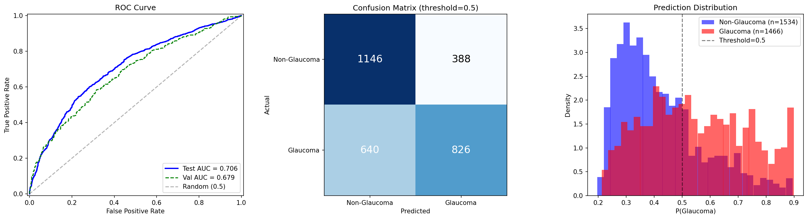

# Frozen Probe: ImageNet SSL ep50, d=3, MLP

Run ID: `frozen_imagenet_ep50_d3_s100`

## Configuration

| Parameter | Value |
|-----------|-------|
| Mode | patch |
| Encoder | vit_base (ViT-B/16) |
| Encoder Checkpoint | jepa_patch-ep50.pth.tar |
| Freeze Encoder | true |
| Probe Depth | 3 |
| Probe Num Heads | 12 |
| Head Type | mlp |
| Num Slices | 100 |
| Slice Size | 256 |
| Crop Size | 256 |
| Patch Size | 16 |
| Batch Size | 64 |
| Accum Steps | 4 |
| LR (probe) | 1e-4 |
| LR (head) | 1e-3 |
| LR (encoder) | 1e-6 (frozen, unused) |
| Weight Decay | 0.01 |
| Dropout | 0.1 |
| Epochs | 50 |
| Patience | 10 |
| Warmup Epochs | 3 |
| Seed | 42 |

## Results

| Metric | Value |
|--------|-------|
| Test AUC | 0.7058 |
| Val AUC (best) | 0.6785 |
| Test Loss | 0.6272 |
| Sensitivity | 0.5634 |
| Specificity | 0.7471 |
| Best Epoch | 49 |
| Probe Params | 21,343,488 |
| Head Params | 198,657 |

## Training Log

| Epoch | Train Loss | Train AUC | Val Loss | Val AUC | LR | Elapsed (s) |
|-------|-----------|-----------|----------|---------|-----|-------------|
| 1 | 0.6978 | 0.5114 | 0.7042 | 0.6184 | 3.33e-5 | 110.8 |
| 2 | 0.6912 | 0.5441 | 0.6924 | 0.6198 | 6.67e-5 | 111.6 |
| 3 | 0.6909 | 0.5646 | 0.7019 | 0.6218 | 1.00e-4 | 111.6 |
| 4 | 0.6755 | 0.6029 | 0.6780 | 0.6244 | 9.99e-5 | 111.2 |
| 5 | 0.6771 | 0.6050 | 0.6760 | 0.6300 | 9.96e-5 | 109.9 |
| 6 | 0.6613 | 0.6417 | 0.6640 | 0.6405 | 9.90e-5 | 110.2 |
| 7 | 0.6583 | 0.6502 | 0.6664 | 0.6521 | 9.82e-5 | 111.3 |
| 8 | 0.6569 | 0.6523 | 0.6568 | 0.6514 | 9.72e-5 | 110.3 |
| 9 | 0.6580 | 0.6482 | 0.6559 | 0.6535 | 9.60e-5 | 110.5 |
| 10 | 0.6557 | 0.6539 | 0.6562 | 0.6533 | 9.46e-5 | 111.7 |
| 11 | 0.6495 | 0.6669 | 0.6550 | 0.6532 | 9.30e-5 | 113.1 |
| 12 | 0.6495 | 0.6681 | 0.6590 | 0.6557 | 9.12e-5 | 112.9 |
| 13 | 0.6569 | 0.6545 | 0.6785 | 0.6551 | 8.92e-5 | 254.6 |
| 14 | 0.6495 | 0.6666 | 0.6639 | 0.6562 | 8.71e-5 | 293.9 |
| 15 | 0.6500 | 0.6663 | 0.6526 | 0.6582 | 8.48e-5 | 294.2 |
| 16 | 0.6535 | 0.6605 | 0.6667 | 0.6585 | 8.23e-5 | 286.9 |
| 17 | 0.6510 | 0.6650 | 0.6679 | 0.6580 | 7.97e-5 | 287.5 |
| 18 | 0.6463 | 0.6724 | 0.6554 | 0.6588 | 7.69e-5 | 290.0 |
| 19 | 0.6477 | 0.6690 | 0.6745 | 0.6599 | 7.40e-5 | 293.5 |
| 20 | 0.6459 | 0.6720 | 0.6754 | 0.6608 | 7.11e-5 | 292.0 |
| 21 | 0.6442 | 0.6761 | 0.6544 | 0.6624 | 6.80e-5 | 291.0 |
| 22 | 0.6399 | 0.6825 | 0.6642 | 0.6633 | 6.48e-5 | 299.0 |
| 23 | 0.6451 | 0.6747 | 0.6584 | 0.6638 | 6.16e-5 | 297.5 |
| 24 | 0.6444 | 0.6758 | 0.6537 | 0.6639 | 5.83e-5 | 297.9 |
| 25 | 0.6404 | 0.6833 | 0.6495 | 0.6648 | 5.50e-5 | 290.7 |
| 26 | 0.6367 | 0.6878 | 0.6482 | 0.6655 | 5.17e-5 | 299.4 |
| 27 | 0.6374 | 0.6871 | 0.6515 | 0.6655 | 4.83e-5 | 307.8 |
| 28 | 0.6397 | 0.6835 | 0.6493 | 0.6661 | 4.50e-5 | 299.9 |
| 29 | 0.6390 | 0.6846 | 0.6478 | 0.6665 | 4.17e-5 | 305.7 |
| 30 | 0.6350 | 0.6903 | 0.6480 | 0.6677 | 3.84e-5 | 296.7 |
| 31 | 0.6322 | 0.6933 | 0.6469 | 0.6689 | 3.52e-5 | 303.2 |
| 32 | 0.6311 | 0.6947 | 0.6486 | 0.6697 | 3.20e-5 | 294.0 |
| 33 | 0.6342 | 0.6904 | 0.6461 | 0.6697 | 2.90e-5 | 300.6 |
| 34 | 0.6301 | 0.6972 | 0.6546 | 0.6709 | 2.60e-5 | 299.7 |
| 35 | 0.6322 | 0.6946 | 0.6463 | 0.6716 | 2.31e-5 | 294.6 |
| 36 | 0.6296 | 0.6963 | 0.6503 | 0.6720 | 2.03e-5 | 292.7 |
| 37 | 0.6291 | 0.6981 | 0.6460 | 0.6726 | 1.77e-5 | 293.3 |
| 38 | 0.6266 | 0.7008 | 0.6429 | 0.6740 | 1.52e-5 | 302.3 |
| 39 | 0.6256 | 0.7009 | 0.6423 | 0.6747 | 1.29e-5 | 294.3 |
| 40 | 0.6250 | 0.7033 | 0.6412 | 0.6754 | 1.08e-5 | 295.9 |
| 41 | 0.6232 | 0.7049 | 0.6484 | 0.6764 | 8.78e-6 | 296.4 |
| 42 | 0.6248 | 0.7041 | 0.6431 | 0.6770 | 6.98e-6 | 302.2 |
| 43 | 0.6221 | 0.7075 | 0.6410 | 0.6774 | 5.37e-6 | 302.5 |
| 44 | 0.6223 | 0.7070 | 0.6417 | 0.6777 | 3.97e-6 | 297.8 |
| 45 | 0.6225 | 0.7065 | 0.6415 | 0.6780 | 2.77e-6 | 299.1 |
| 46 | 0.6203 | 0.7083 | 0.6415 | 0.6781 | 1.78e-6 | 300.8 |
| 47 | 0.6193 | 0.7102 | 0.6410 | 0.6782 | 1.00e-6 | 298.7 |
| 48 | 0.6205 | 0.7086 | 0.6405 | 0.6784 | 4.50e-7 | 306.6 |
| 49 | **0.6189** | **0.7101** | **0.6404** | **0.6785** | 1.10e-7 | 298.5 |
| 50 | 0.6196 | 0.7095 | 0.6404 | 0.6785 | 0.00e+0 | 295.5 |

*Ran all 50 epochs. Best val AUC at epoch 49.*

## Diagnostic Plots

[<-- Back to frozen probe overview](README.md)
