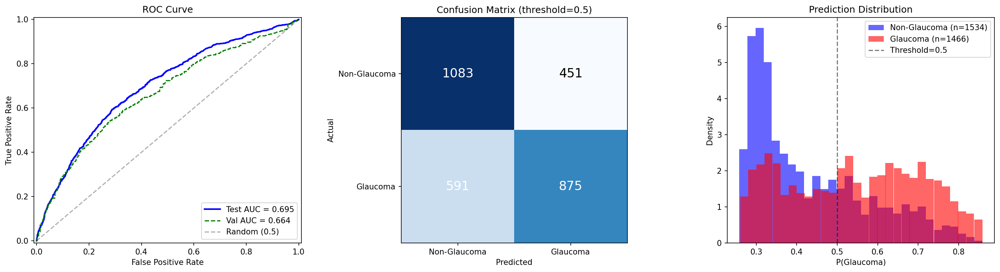

# Frozen Probe: ImageNet SSL ep75, d=3, MLP

Run ID: `frozen_imagenet_ep75_d3_s100`

## Configuration

| Parameter | Value |
|-----------|-------|
| Mode | patch |
| Encoder | vit_base (ViT-B/16) |
| Encoder Checkpoint | jepa_patch-ep75.pth.tar |
| Freeze Encoder | true |
| Probe Depth | 3 |
| Probe Num Heads | 12 |
| Head Type | mlp |
| Num Slices | 100 |
| Slice Size | 256 |
| Crop Size | 256 |
| Patch Size | 16 |
| Batch Size | 64 |
| Accum Steps | 4 |
| LR (probe) | 1e-4 |
| LR (head) | 1e-3 |
| LR (encoder) | 1e-6 (frozen, unused) |
| Weight Decay | 0.01 |
| Dropout | 0.1 |
| Epochs | 50 |
| Patience | 10 |
| Warmup Epochs | 3 |
| Seed | 42 |

## Results

| Metric | Value |
|--------|-------|
| Test AUC | 0.6950 |
| Val AUC (best) | 0.6637 |
| Test Loss | 0.6340 |
| Sensitivity | 0.5969 |
| Specificity | 0.7060 |
| Best Epoch | 47 |
| Probe Params | 21,343,488 |
| Head Params | 198,657 |

## Training Log

| Epoch | Train Loss | Train AUC | Val Loss | Val AUC | LR | Elapsed (s) |
|-------|-----------|-----------|----------|---------|-----|-------------|
| 1 | 0.6982 | 0.5112 | 0.7048 | 0.6205 | 3.33e-5 | 296.7 |
| 2 | 0.6946 | 0.5178 | 0.6985 | 0.6226 | 6.67e-5 | 295.0 |
| 3 | 0.6937 | 0.5346 | 0.6973 | 0.6219 | 1.00e-4 | 286.1 |
| 4 | 0.6940 | 0.5140 | 0.6896 | 0.6229 | 9.99e-5 | 284.9 |
| 5 | 0.6887 | 0.5550 | 0.6934 | 0.6235 | 9.96e-5 | 285.5 |
| 6 | 0.6794 | 0.5939 | 0.6798 | 0.6284 | 9.90e-5 | 290.6 |
| 7 | 0.6739 | 0.6099 | 0.6799 | 0.6373 | 9.82e-5 | 285.8 |
| 8 | 0.6640 | 0.6403 | 0.6655 | 0.6473 | 9.72e-5 | 281.7 |
| 9 | 0.6658 | 0.6361 | 0.6939 | 0.6485 | 9.60e-5 | 293.2 |
| 10 | 0.6639 | 0.6353 | 0.6566 | 0.6487 | 9.46e-5 | 291.9 |
| 11 | 0.6535 | 0.6591 | 0.6576 | 0.6496 | 9.30e-5 | 288.2 |
| 12 | 0.6510 | 0.6662 | 0.6570 | 0.6511 | 9.12e-5 | 284.7 |
| 13 | 0.6569 | 0.6534 | 0.6764 | 0.6517 | 8.92e-5 | 289.8 |
| 14 | 0.6526 | 0.6616 | 0.6613 | 0.6532 | 8.71e-5 | 290.1 |
| 15 | 0.6537 | 0.6583 | 0.6557 | 0.6540 | 8.48e-5 | 293.3 |
| 16 | 0.6559 | 0.6559 | 0.6637 | 0.6544 | 8.23e-5 | 300.8 |
| 17 | 0.6526 | 0.6607 | 0.6679 | 0.6554 | 7.97e-5 | 295.7 |
| 18 | 0.6492 | 0.6669 | 0.6553 | 0.6565 | 7.69e-5 | 298.3 |
| 19 | 0.6512 | 0.6637 | 0.6804 | 0.6565 | 7.40e-5 | 295.7 |
| 20 | 0.6501 | 0.6632 | 0.6845 | 0.6570 | 7.11e-5 | 292.4 |
| 21 | 0.6486 | 0.6680 | 0.6556 | 0.6579 | 6.80e-5 | 298.4 |
| 22 | 0.6435 | 0.6769 | 0.6633 | 0.6587 | 6.48e-5 | 288.2 |
| 23 | 0.6486 | 0.6683 | 0.6608 | 0.6590 | 6.16e-5 | 283.7 |
| 24 | 0.6503 | 0.6643 | 0.6548 | 0.6589 | 5.83e-5 | 289.3 |
| 25 | 0.6448 | 0.6751 | 0.6525 | 0.6585 | 5.50e-5 | 287.3 |
| 26 | 0.6431 | 0.6777 | 0.6556 | 0.6601 | 5.17e-5 | 301.0 |
| 27 | 0.6438 | 0.6772 | 0.6518 | 0.6602 | 4.83e-5 | 285.3 |
| 28 | 0.6438 | 0.6758 | 0.6505 | 0.6611 | 4.50e-5 | 291.9 |
| 29 | 0.6447 | 0.6748 | 0.6513 | 0.6615 | 4.17e-5 | 285.7 |
| 30 | 0.6430 | 0.6778 | 0.6517 | 0.6613 | 3.84e-5 | 294.6 |
| 31 | 0.6427 | 0.6784 | 0.6580 | 0.6617 | 3.52e-5 | 300.0 |
| 32 | 0.6405 | 0.6805 | 0.6513 | 0.6623 | 3.20e-5 | 291.5 |
| 33 | 0.6421 | 0.6784 | 0.6504 | 0.6614 | 2.90e-5 | 293.0 |
| 34 | 0.6399 | 0.6828 | 0.6523 | 0.6621 | 2.60e-5 | 291.9 |
| 35 | 0.6415 | 0.6803 | 0.6514 | 0.6619 | 2.31e-5 | 291.7 |
| 36 | 0.6403 | 0.6821 | 0.6518 | 0.6622 | 2.03e-5 | 297.6 |
| 37 | 0.6389 | 0.6842 | 0.6505 | 0.6626 | 1.77e-5 | 298.4 |
| 38 | 0.6390 | 0.6841 | 0.6499 | 0.6629 | 1.52e-5 | 296.7 |
| 39 | 0.6375 | 0.6859 | 0.6514 | 0.6629 | 1.29e-5 | 281.8 |
| 40 | 0.6378 | 0.6854 | 0.6498 | 0.6632 | 1.08e-5 | 236.8 |
| 41 | 0.6378 | 0.6856 | 0.6499 | 0.6634 | 8.78e-6 | 168.4 |
| 42 | 0.6370 | 0.6855 | 0.6505 | 0.6633 | 6.98e-6 | 168.1 |
| 43 | 0.6380 | 0.6844 | 0.6510 | 0.6635 | 5.37e-6 | 168.9 |
| 44 | 0.6378 | 0.6856 | 0.6503 | 0.6637 | 3.97e-6 | 166.7 |
| 45 | 0.6374 | 0.6855 | 0.6499 | 0.6636 | 2.77e-6 | 167.1 |
| 46 | 0.6359 | 0.6882 | 0.6499 | 0.6637 | 1.78e-6 | 169.6 |
| 47 | **0.6359** | **0.6883** | **0.6498** | **0.6637** | 1.00e-6 | 167.3 |
| 48 | 0.6375 | 0.6859 | 0.6498 | 0.6637 | 4.50e-7 | 168.2 |
| 49 | 0.6363 | 0.6876 | 0.6498 | 0.6637 | 1.10e-7 | 167.3 |
| 50 | 0.6362 | 0.6874 | 0.6498 | 0.6637 | 0.00e+0 | 167.4 |

*Ran all 50 epochs. Best val AUC at epoch 47.*

## Diagnostic Plots

[<-- Back to frozen probe overview](README.md)
