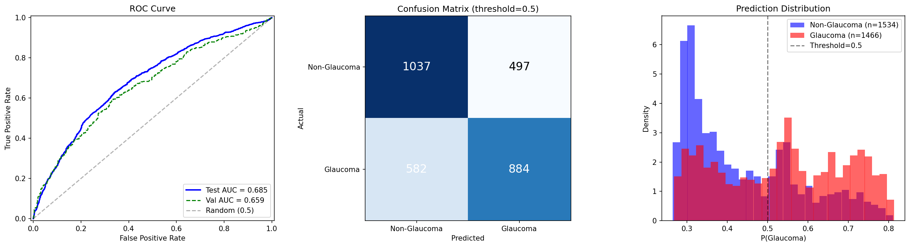

# Frozen Probe: ImageNet SSL ep99 (latest), d=3, MLP

Run ID: `frozen_imagenet_ep99_d3_s100`

## Configuration

| Parameter | Value |
|-----------|-------|
| Mode | patch |
| Encoder | vit_base (ViT-B/16) |
| Encoder Checkpoint | jepa_patch-latest.pth.tar (ep99) |
| Freeze Encoder | true |
| Probe Depth | 3 |
| Probe Num Heads | 12 |
| Head Type | mlp |
| Num Slices | 100 |
| Slice Size | 256 |
| Crop Size | 256 |
| Patch Size | 16 |
| Batch Size | 64 |
| Accum Steps | 4 |
| LR (probe) | 1e-4 |
| LR (head) | 1e-3 |
| LR (encoder) | 1e-6 (frozen, unused) |
| Weight Decay | 0.01 |
| Dropout | 0.1 |
| Epochs | 50 |
| Patience | 10 |
| Warmup Epochs | 3 |
| Seed | 42 |

## Results

| Metric | Value |
|--------|-------|
| Test AUC | 0.6847 |
| Val AUC (best) | 0.6588 |
| Test Loss | 0.6404 |
| Sensitivity | 0.6030 |
| Specificity | 0.6760 |
| Best Epoch | 47 |
| Probe Params | 21,343,488 |
| Head Params | 198,657 |

## Training Log

| Epoch | Train Loss | Train AUC | Val Loss | Val AUC | LR | Elapsed (s) |
|-------|-----------|-----------|----------|---------|-----|-------------|
| 1 | 0.6985 | 0.5069 | 0.7033 | 0.6225 | 3.33e-5 | 298.5 |
| 2 | 0.6948 | 0.5090 | 0.6957 | 0.6251 | 6.67e-5 | 303.8 |
| 3 | 0.6933 | 0.5175 | 0.6946 | 0.6239 | 1.00e-4 | 302.1 |
| 4 | 0.6941 | 0.5084 | 0.6911 | 0.6237 | 9.99e-5 | 297.8 |
| 5 | 0.6943 | 0.5148 | 0.6926 | 0.6252 | 9.96e-5 | 299.8 |
| 6 | 0.6935 | 0.5180 | 0.6915 | 0.6239 | 9.90e-5 | 304.2 |
| 7 | 0.6916 | 0.5518 | 0.6854 | 0.6243 | 9.82e-5 | 296.0 |
| 8 | 0.6845 | 0.5759 | 0.6679 | 0.6314 | 9.72e-5 | 300.8 |
| 9 | 0.6709 | 0.6215 | 0.6699 | 0.6442 | 9.60e-5 | 298.0 |
| 10 | 0.6739 | 0.6142 | 0.6630 | 0.6486 | 9.46e-5 | 298.6 |
| 11 | 0.6636 | 0.6391 | 0.6600 | 0.6489 | 9.30e-5 | 298.9 |
| 12 | 0.6567 | 0.6543 | 0.6577 | 0.6488 | 9.12e-5 | 302.7 |
| 13 | 0.6623 | 0.6416 | 0.6797 | 0.6495 | 8.92e-5 | 298.6 |
| 14 | 0.6564 | 0.6545 | 0.6689 | 0.6489 | 8.71e-5 | 298.0 |
| 15 | 0.6589 | 0.6486 | 0.6570 | 0.6512 | 8.48e-5 | 299.1 |
| 16 | 0.6568 | 0.6528 | 0.6686 | 0.6539 | 8.23e-5 | 301.3 |
| 17 | 0.6571 | 0.6562 | 0.6638 | 0.6520 | 7.97e-5 | 293.0 |
| 18 | 0.6546 | 0.6573 | 0.6590 | 0.6531 | 7.69e-5 | 300.6 |
| 19 | 0.6528 | 0.6610 | 0.6857 | 0.6533 | 7.40e-5 | 298.2 |
| 20 | 0.6515 | 0.6629 | 0.6786 | 0.6535 | 7.11e-5 | 297.4 |
| 21 | 0.6537 | 0.6600 | 0.6581 | 0.6537 | 6.80e-5 | 295.4 |
| 22 | 0.6491 | 0.6674 | 0.6612 | 0.6554 | 6.48e-5 | 299.2 |
| 23 | 0.6552 | 0.6577 | 0.6613 | 0.6542 | 6.16e-5 | 297.7 |
| 24 | 0.6550 | 0.6578 | 0.6581 | 0.6551 | 5.83e-5 | 295.1 |
| 25 | 0.6483 | 0.6693 | 0.6548 | 0.6559 | 5.50e-5 | 298.4 |
| 26 | 0.6458 | 0.6732 | 0.6600 | 0.6564 | 5.17e-5 | 299.3 |
| 27 | 0.6487 | 0.6686 | 0.6548 | 0.6561 | 4.83e-5 | 306.4 |
| 28 | 0.6505 | 0.6660 | 0.6541 | 0.6572 | 4.50e-5 | 300.8 |
| 29 | 0.6496 | 0.6671 | 0.6549 | 0.6576 | 4.17e-5 | 299.5 |
| 30 | 0.6475 | 0.6712 | 0.6542 | 0.6575 | 3.84e-5 | 297.2 |
| 31 | 0.6443 | 0.6748 | 0.6576 | 0.6563 | 3.52e-5 | 296.6 |
| 32 | 0.6439 | 0.6762 | 0.6537 | 0.6581 | 3.20e-5 | 302.9 |
| 33 | 0.6459 | 0.6729 | 0.6530 | 0.6574 | 2.90e-5 | 302.8 |
| 34 | 0.6436 | 0.6779 | 0.6547 | 0.6579 | 2.60e-5 | 302.7 |
| 35 | 0.6454 | 0.6750 | 0.6532 | 0.6581 | 2.31e-5 | 298.2 |
| 36 | 0.6433 | 0.6777 | 0.6556 | 0.6579 | 2.03e-5 | 304.2 |
| 37 | 0.6433 | 0.6775 | 0.6541 | 0.6585 | 1.77e-5 | 307.8 |
| 38 | 0.6440 | 0.6755 | 0.6517 | 0.6584 | 1.52e-5 | 298.2 |
| 39 | 0.6424 | 0.6785 | 0.6539 | 0.6586 | 1.29e-5 | 241.5 |
| 40 | 0.6423 | 0.6787 | 0.6518 | 0.6588 | 1.08e-5 | 196.1 |
| 41 | 0.6428 | 0.6780 | 0.6520 | 0.6587 | 8.78e-6 | 167.8 |
| 42 | 0.6413 | 0.6800 | 0.6528 | 0.6584 | 6.98e-6 | 166.9 |
| 43 | 0.6416 | 0.6800 | 0.6535 | 0.6583 | 5.37e-6 | 165.2 |
| 44 | 0.6421 | 0.6788 | 0.6523 | 0.6585 | 3.97e-6 | 165.3 |
| 45 | 0.6406 | 0.6819 | 0.6525 | 0.6588 | 2.77e-6 | 165.8 |
| 46 | 0.6406 | 0.6810 | 0.6521 | 0.6588 | 1.78e-6 | 166.5 |
| 47 | **0.6399** | **0.6824** | **0.6520** | **0.6588** | 1.00e-6 | 168.1 |
| 48 | 0.6416 | 0.6792 | 0.6519 | 0.6588 | 4.50e-7 | 164.0 |
| 49 | 0.6417 | 0.6792 | 0.6519 | 0.6588 | 1.10e-7 | 166.7 |
| 50 | 0.6411 | 0.6802 | 0.6519 | 0.6588 | 0.00e+0 | 166.8 |

*Ran all 50 epochs. Best val AUC at epoch 47.*

## Diagnostic Plots

[<-- Back to frozen probe overview](README.md)
