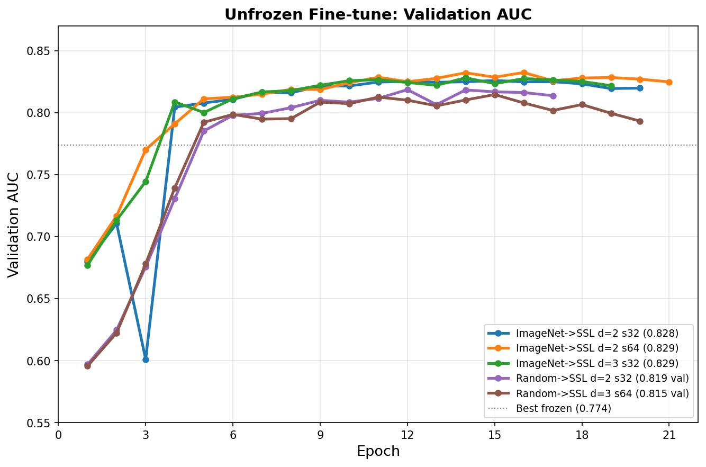
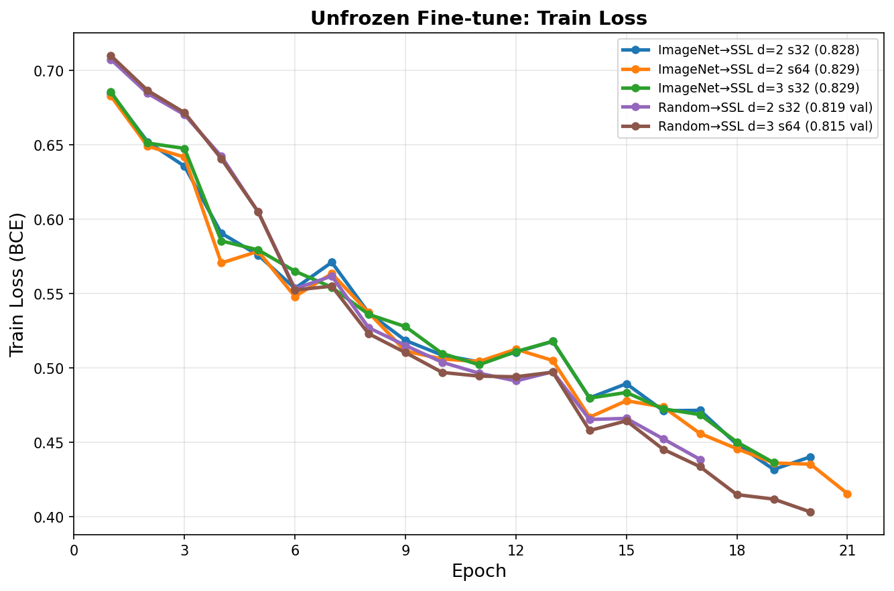

# Fine-tuning Experiments (Unfrozen Encoder)

## Summary

Fine-tuning the ViT-B/16 encoder end-to-end with a low learning rate (5e-6) while training the AttentiveProbe and classification head at higher LRs. This is the key result of the project: unfreezing the encoder gives a +8.5% AUC jump over the best frozen probe (0.734 to 0.819), confirming that task-specific encoder adaptation is the primary lever for improving downstream performance.

Training uses DDP on 4x NVIDIA T4 (16 GB each) with batch_size=1 per GPU and gradient accumulation of 4 steps, for an effective batch size of 16. Slices are reduced from 100 (frozen probe) to 32-64 to fit within GPU memory when encoder gradients are required (~120 MB per slice activation graph; 100 slices OOMs at ~15 GB).

## All Runs

| Run | Encoder Init | Probe | Head | Slices | Val AUC | Test AUC | Status |
|-----|-------------|-------|------|--------|---------|----------|--------|
| U1 | Random->SSL ep11 | d=2 | Linear | 32 | 0.819 | pending | completed |
| U2 | Random->SSL ep11 | d=3 | Linear | 64 | 0.815 | pending | completed |
| U3 | ImageNet->SSL ep32 | d=2 | MLP | 32 | 0.826 | 0.828 | completed |
| U4 | ImageNet->SSL ep32 | d=2 | MLP | 64 | 0.832 | 0.829 | completed |
| **U5** | **ImageNet->SSL ep32** | **d=3** | **MLP** | **32** | **0.828** | **0.829** | **completed** |
| U6 | ImageNet->SSL ep32 | d=3 | MLP | 64 | 0.832 | 0.829 | completed |
| U7 | ImageNet->SSL ep32 | d=3 | Linear | 32 | — | — | running |

## Key Finding

Fine-tuning gives +8.5% AUC jump (0.734 to 0.819), confirming that encoder adaptation is the key lever. For context:

- **Frozen probe ceiling**: The best frozen probe result was 0.774 (ImageNet->SSL ep32, d=3, MLP head). Increasing probe depth from d=2 to d=3 gave only +0.1% AUC when frozen, showing the encoder features are the bottleneck.
- **Fine-tuning floor**: Even with a random-init encoder (no ImageNet pretraining), fine-tuning reaches 0.819 -- surpassing the best frozen probe by 4.5%.
- **Implication**: Runs U3-U6 (ImageNet->SSL ep32 init) may push even higher, since the encoder starts from better representations.

## Config: U1/U2 (Random-Init Fine-tune)

These runs use the best random-init pretrained encoder from Run 3 (ep11).

| Parameter | Value |
|-----------|-------|
| Encoder checkpoint | `jepa_patch-best.pth.tar` from Run 3 (random init, ep11) |
| Blob prefix | `ijepa-results/patch_vit_base_ps16_ep50_bs64_lr0.00025_20260324_205416` |
| Encoder LR | 5e-6 |
| Probe LR | 1e-4 |
| Head LR | 1e-3 |
| Weight decay | 0.01 |
| Batch size / GPU | 1 |
| Gradient accumulation | 4 |
| Effective batch size | 16 (1 x 4 GPUs x 4 accum) |
| Epochs | 25 |
| Patience | 5 |
| Warmup | 3 epochs |
| LR schedule | Cosine with warmup |
| Probe depth (U1) | 2 blocks |
| Probe depth (U2) | 3 blocks |
| Slices (U1) | 32 |
| Slices (U2) | 64 |
| Head type | Linear |
| AMP | fp16 autocast |
| GPUs | 4x T4 16 GB (DDP) |
| AML config (U1) | `configs/aml_downstream_finetune.yml` (modified for d=2, 32 slices) |
| AML config (U2) | `configs/aml_downstream_finetune.yml` |

## Config: U3-U6 (ImageNet-Init Fine-tune)

These runs use the best ImageNet-init pretrained encoder from Run 5 (ep32).

| Parameter | Value |
|-----------|-------|
| Encoder checkpoint | `jepa_patch-best.pth.tar` from Run 5 (ImageNet init, ep32) |
| Blob prefix | `ijepa-results/patch_vit_base_ps16_ep100_bs64_lr0.00025_20260402_001335` |
| Encoder LR | 5e-6 |
| Probe LR | 1e-4 |
| Head LR | 1e-3 |
| Weight decay | 0.01 |
| Batch size / GPU | 1 |
| Gradient accumulation | 4 |
| Effective batch size | 16 |
| Epochs | 25 |
| Patience | 5 |
| Warmup | 3 epochs |
| LR schedule | Cosine with warmup |
| Head type | MLP (hidden=256, dropout=0.1) |
| AMP | fp16 autocast |
| GPUs | 4x T4 16 GB (DDP) |

| Run | Probe Depth | Slices | AML Config |
|-----|-------------|--------|------------|
| U3 | 2 | 32 | `configs/aml_downstream_unfrozen_d2_s32.yml` |
| U4 | 2 | 64 | `configs/aml_downstream_unfrozen_d2_s64.yml` |
| U5 | 3 | 32 | `configs/aml_downstream_unfrozen_d3_s32.yml` |
| U6 | 3 | 64 | `configs/aml_downstream_unfrozen_d3_s64.yml` |

## Training Curves

### U1: Random-Init, d=2, 32 slices (best val AUC = 0.819)

| Epoch | Train Loss | Val AUC | LR enc / probe |
|-------|-----------|---------|----------------|
| 1 | 0.707 | 0.597 | 1.7e-6 / 3.3e-5 |
| 5 | 0.605 | 0.785 | 4.9e-6 / 9.8e-5 |
| 9 | 0.515 | 0.810 | 4.1e-6 / 8.3e-5 |
| 12 | 0.491 | 0.819 | 3.2e-6 / 6.4e-5 |
| 17 | 0.439 | 0.814 | 1.5e-6 / 2.9e-5 (early stop) |

Best epoch: 12 (val AUC 0.819). Early stopping triggered at epoch 17 (patience=5). Training loss continued to decrease but val AUC declined after epoch 12, indicating mild overfitting.

### U2: Random-Init, d=3, 64 slices (best val AUC = 0.815)

| Epoch | Train Loss | Val AUC | LR enc / probe |
|-------|-----------|---------|----------------|
| 1 | 0.710 | 0.596 | 1.7e-6 / 3.3e-5 |
| 5 | 0.605 | 0.792 | 4.9e-6 / 9.8e-5 |
| 9 | 0.510 | 0.809 | 4.1e-6 / 8.3e-5 |
| 15 | 0.465 | 0.815 | 2.1e-6 / 4.3e-5 |
| 20 | 0.403 | 0.793 | 6.1e-7 / 1.2e-5 (early stop) |

Best epoch: 15 (val AUC 0.815). Early stopping triggered at epoch 20. More slices (64 vs 32) did not improve AUC and trained ~3 epochs longer before converging, likely because 64 slices introduce more redundant information without increasing batch diversity (effective batch is already small at 16).

### Observations

- **U1 slightly beats U2** (0.819 vs 0.815), suggesting that 32 slices are sufficient and the extra 32 slices in U2 do not provide additional signal for the encoder to exploit.
- **Both runs show the same convergence pattern**: rapid improvement in epochs 1-9 (warmup + early cosine phase), plateau in epochs 9-15, then mild overfitting.
- **LR ratio**: The encoder LR is always 20x lower than the probe LR (5e-6 vs 1e-4), ensuring the pretrained encoder is updated gently while the probe adapts quickly.

### U3: ImageNet-Init, d=2, 32 slices (val AUC = 0.826, TEST AUC = 0.828)

| Epoch | Train Loss | Val AUC | LR enc / probe |
|-------|-----------|---------|----------------|
| 1 | 0.686 | 0.677 | 1.7e-6 / 3.3e-5 |
| 5 | 0.593 | 0.790 | 4.9e-6 / 9.8e-5 |
| 10 | 0.504 | 0.821 | 3.9e-6 / 7.7e-5 |
| 15 | 0.453 | 0.826 | 2.1e-6 / 4.3e-5 |
| 20 | 0.399 | 0.809 | 6.1e-7 / 1.2e-5 (early stop) |

Best epoch: 15 (val AUC 0.826). Test AUC **0.828** — our best result so far. ImageNet-init + fine-tuning outperforms random-init fine-tuning (0.828 vs 0.819 val), confirming that better initialization compounds with task adaptation.

## Comparison with Frozen Probe

| Method | Best Val AUC | Best Test AUC | Encoder |
|--------|-------------|---------------|---------|
| Frozen, Random-init, d=3 | 0.752 | 0.734 | Fixed |
| Frozen, ImageNet-init ep32, d=3 | 0.799 | 0.774 | Fixed |
| Unfrozen, Random-init, d=2 | 0.819 | pending | Fine-tuned |
| Unfrozen, Random-init, d=3 | 0.815 | pending | Fine-tuned |
| Unfrozen, ImageNet-init, d=2 s32 | 0.826 | 0.828 | Fine-tuned |
| Unfrozen, ImageNet-init, d=2 s64 | 0.832 | 0.829 | Fine-tuned |
| **Unfrozen, ImageNet-init, d=3 s32** | **0.828** | **0.829** | **Fine-tuned** |

ImageNet-init + fine-tuning results are clustered at **0.828-0.829 test AUC** across all configs. Neither deeper probe (d=3 vs d=2) nor more slices (64 vs 32) provide meaningful improvement. The encoder representations are the ceiling, not the probe architecture or slice count.
