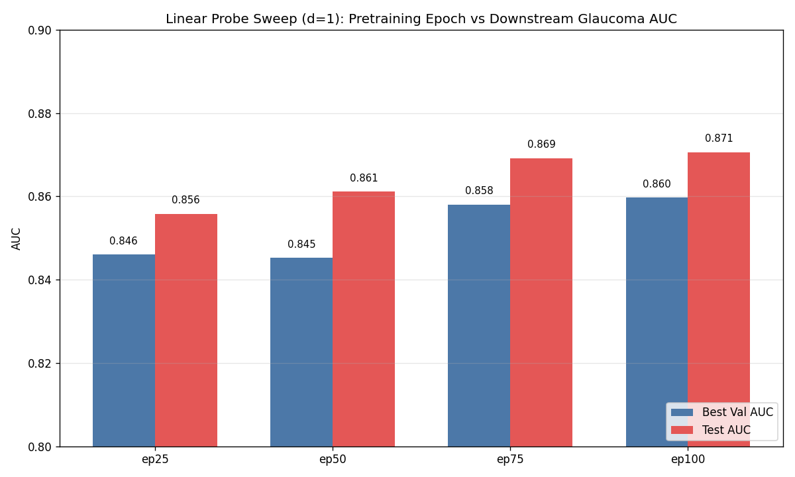

# Frozen Probe Experiments

Encoder frozen (no gradients). Features pre-computed once per volume and cached. Only the probe + linear head are trained.

Pipeline: frozen ViT-B/16 → mean-pool patches within each slice → `(100 slices, 768 dim)` per volume → slice-aggregation probe → pooled 768-dim volume vector → LinearHead → logit. Loss: BCEWithLogitsLoss.

## Results on ep100 checkpoint (best from d=1 sweep)

| Probe | Params | Pos info | Val AUC | Test AUC | Detail |
|---|---|---|---|---|---|
| AttentiveProbe d=1 | 7.17M | Yes (77K pos_embed + self-attn) | 0.8597 | 0.8706 | [d1_sweep.md](d1_sweep.md) |
| **CrossAttnPool** | **277K** | Yes (76K pos_embed + cross-attn) | **0.8650** | **0.8791** | [cross_attn_pool.md](cross_attn_pool.md) |
| MeanPool + Linear | 2.3K | **No** | running | running | [mean_pool.md](mean_pool.md) |

All rows share identical hyperparameters (bs=256, lr=4e-4, wd=0.05, dropout=0.2, 50 ep, patience=15, warmup=5) — the comparison isolates probe architecture only.

## Key lessons

1. **CrossAttnPool matches d=1 at 26× fewer params.** The single cross-attention pool with slice pos_embed is sufficient; the self-attention among slices + FFN in the I-JEPA-style d=1 probe add capacity that doesn't translate to AUC gains.
2. **Encoder is the ceiling, not probe capacity.** Across d=3 (21M), d=1 (7M), CrossAttnPool (277K), Val AUC varies within 0.01. Probes above ~7M overfit. See `lessons_learned.md` #7.
3. **Frozen-probe ceiling is ~0.87-0.88 Test AUC on this dataset.** Fine-tune is the lever for the next 1-2%.

## Sweep plots

Per-pretraining-epoch Val/Test AUC from d=1 sweep ([d1_sweep.md](d1_sweep.md)):

