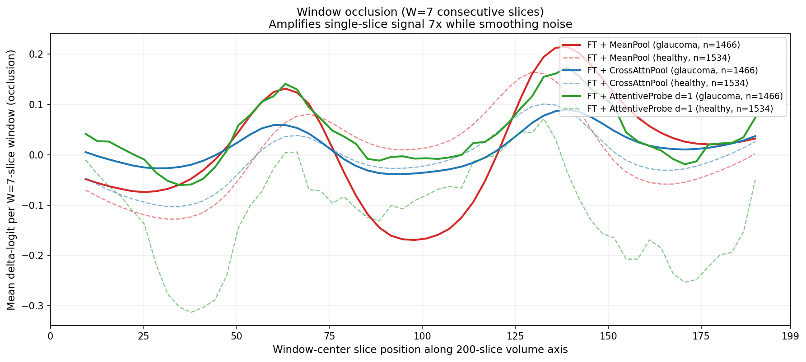
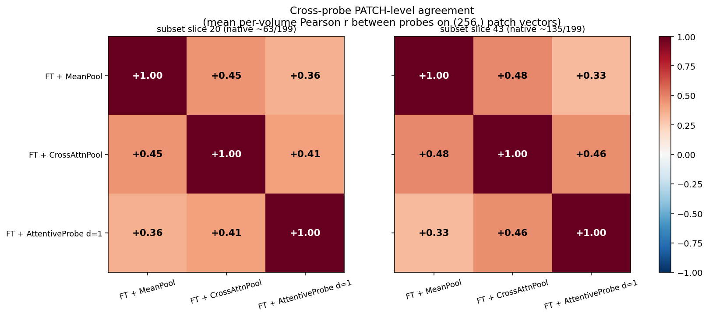
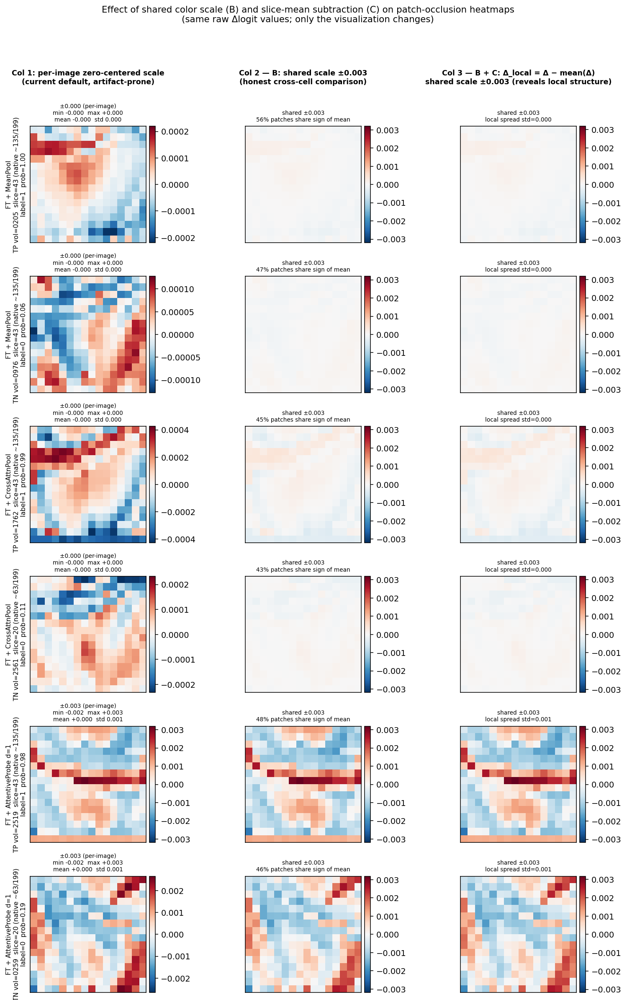
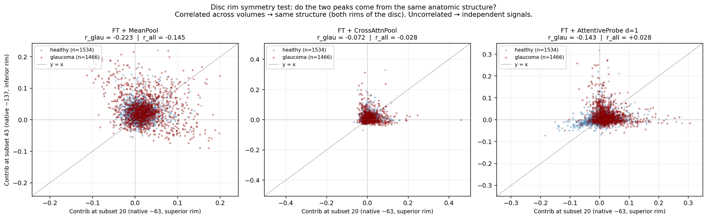

# Interpretability — Occlusion Attribution on the 3 Fine-Tune Probes

Architecture-agnostic occlusion attribution for the three fine-tune probes that tied at Test AUC ~0.887. Goal: validate that the probes actually use the same signal, and find what that signal is at the slice, patch, and pixel level.

Pipeline: [`scripts/interpretability.py`](../../scripts/interpretability.py). Results are derived from two AML jobs (initial attribution + patch aggregate over 3000 volumes) plus local post-hoc analyses.

## Method

```
OCT volume → (64 slices, 3, 256, 256)
 → frozen-ish encoder → 256 patch tokens/slice
 → mean over patches → (64, 768) slice tokens F
 → probe → (768,) pooled vector
 → LayerNorm + Linear → logit

Inverse (all architecture-agnostic, all causal):
  Slice-level:   for s in 0..63:  zero F[s], measure Δlogit
  Window-level:  for w in 0..57:  zero F[w..w+6], measure Δlogit  (W=7)
  Patch-level:   for p in 0..255: leave-one-out on patch tokens of target slice,
                                  substitute altered mean into F, measure Δlogit
```

Occlusion is used instead of gradient × input because the CrossAttnPool and d=1 probes are non-linear in F — gradient attribution gives misleading numbers there. Occlusion remains valid for all three probes.

## Slice-level attribution — all three probes converge

Single-slice zero-mask occlusion, averaged across 1,466 glaucoma + 1,534 healthy volumes, plotted against native volume slice position (0-199):


All three probes show the same shape: peaks at native ~63 and ~137, dip at ~95. MeanPool and CrossAttnPool correlate at **r = 0.94**. d=1 (green) is noisier but traces the same envelope.

## Window occlusion — the cleaner primitive

Zeroing 7 consecutive slices instead of 1 amplifies the signal ~7× (peaks reach ±0.22 instead of ±0.03) and smooths single-volume noise. This is the attribution primitive we recommend using going forward:



## Key findings at a glance

| # | Claim | Figure / sheet |
|---|---|---|
| 1 | All 3 probes agree on **which slices** matter (r=0.94 slice-level) | figure above |
| 2 | Wrong predictions use the **same pattern with weaker signal**, not different anatomy | [`slice_contribution_by_outcome.png`](../../results/summary/slice_contribution_by_outcome.png) |
| 3 | The pattern is statistically robust (tight bootstrap CI at n=1466) | [`slice_contribution_ci.png`](../../results/summary/slice_contribution_ci.png) |
| 4 | **Window occlusion (W=7) amplifies the signal ~7× and cleans it** | figure above |
| 5 | Per-patch attribution concentrates on the B-scan center | [`05_patch_aggregate.png`](../../results/summary/05_patch_aggregate.png) |
| 6 | Individual B-scans show clinical landmarks (RNFL thinning, cup excavation) | embedded below |
| 7 | **Probes agree strongly at slice level (r=0.94) AND meaningfully at patch level (r=0.35–0.48)** | embedded below |
| 8 | Window occlusion recovers 25× more signal than single-slice for MeanPool | [`10_completeness_window.png`](../../results/summary/10_completeness_window.png) |
| 9 | **84–91% of patches are statistically non-zero** (95% bootstrap CI, glaucoma class, B=500) | [`11_patch_ci_significance.png`](../../results/summary/11_patch_ci_significance.png) |
| 10 | Attribution structure is nearly invariant to prediction confidence | [`13_attribution_vs_confidence.png`](../../results/summary/13_attribution_vs_confidence.png) |

## Cross-model agreement — strong at slice level, moderate at patch level

| Pair | Slice-level r | Patch-level r (per-volume, slice 20 / 43) | Interpretation |
|---|---|---|---|
| MeanPool vs CrossAttnPool | **0.94** | **0.45 / 0.48** | Strong slice agreement; moderate patch agreement |
| MeanPool vs d=1 | 0.53 | 0.36 / 0.33 | Both lower; d=1 the least similar to the pooling pair |
| CrossAttnPool vs d=1 | 0.59 | 0.41 / 0.46 | Moderate agreement at both levels |



After removing the fp16 precision floor in the occlusion pipeline (see caveat below), the probes show substantial patch-level agreement (r ≈ 0.35–0.48) — not the near-zero r ≈ 0.10 reported in the earlier version. Slice-level agreement (0.94) is still considerably stronger, so the hierarchy "slice > patch" stands; but the "same slices, different patches" claim from the first version was largely a precision artifact. The probes look at overlapping patches, just less tightly than they agree on slices.

Representative B-scan overlays (6 curated examples, 1 TP + 1 TN per probe) with patch-level heatmaps:


Visible clinical anatomy in these examples: RNFL thinning (MeanPool glaucoma, top), optic disc cup excavation (d=1 glaucoma, middle rows), retinal-band attribution (all).

### Reading these maps honestly: shared-scale + slice-mean subtraction

The per-subplot color scaling in the overlay above (`vmax = |Δ|.max()` per image) can make a map with a narrow dynamic range saturate to "solid blue," looking more decisive than it is. Two post-hoc transforms disambiguate:

- **B** — shared zero-centered vmax across all cells. For 6 curated examples (1 TP + 1 TN per probe, slice 20 or 43 chosen per volume by signal magnitude), the global max |Δ| in the fp32 occlusion is **±0.003** — still narrow, confirming the per-patch signal is small in absolute terms.
- **C** — plot `Δ_local(p) = Δ(p) − mean(Δ)`. Strips the "whole slice matters as a unit" component and exposes within-slice spatial structure.



Operationally: even with fp32 occlusion, per-patch Δlogit stays small (±0.003 in the curated set) because each patch contributes ~1/256 of the slice mean. What changes vs the fp16 version is that the within-slice variation is now continuous (not ULP-quantised), and the per-patch map genuinely reflects spatial structure rather than rounding steps. This is consistent with the new cross-probe patch r ≈ 0.35–0.48 above — there IS meaningful spatial agreement between probes, hidden under fp16 quantisation noise in the earlier analysis.

> **Note on how this was fixed**: the original `patch_aggregate.py` and the phase-3 heatmap path in `interpretability.py` ran probe+head under `autocast()`, so the per-patch Δlogit snapped to fp16 ULPs (global max ±0.008, effectively a handful of discrete steps). The slice- and window-level figures were always unaffected (those deltas are ±0.03–0.22, well above the fp16 floor). Patch-level figures and tables in this doc were refreshed from the fp32 rerun (AML job `bright_store_h0tdrcmg6n`, blob `ijepa-interpretability/patch_aggregate_20260421_084000/`).

## Completeness under occlusion

Median `|sum(contribs)| / |baseline_logit|` ratio:

| Model | Single-slice (W=1) | Window (W=7) | Amplification |
|---|---|---|---|
| MeanPool | **1.3%** | 32.4% | **25×** |
| CrossAttnPool | 6.0% | 52.0% | 8.6× |
| d=1 AttentiveProbe | 48.6% | **304.9%** | 6.3× |

- Under single-slice zero-mask, MeanPool contribs explain only 1.3% of the logit because removing 1 of 64 pool inputs barely moves the mean. Window W=7 recovers 25× more signal.
- d=1 under window occlusion **overshoots** (sum > 3× logit) — direct evidence that its self-attention nonlinearly amplifies large perturbations. The choice of occlusion primitive matters more for d=1 than for MeanPool.
- **Actionable**: window occlusion is the correct primitive for slice-level attribution on mean-pool models.

## Population-level two-peak structure — with caveat

Population-averaged slice attribution shows a bimodal structure: peak at native position ~63, dip at ~95, peak at ~137. A naive reading maps this to superior + inferior optic disc rim.

**This interpretation is NOT supported by per-volume data.** Correlation between per-volume contribs at the two peaks is **slightly negative**:

| Model | r (glaucoma class) |
|---|---|
| MeanPool | −0.22 |
| CrossAttnPool | −0.07 |
| d=1 | −0.14 |

If both peaks came from the same bilateral anatomic structure, per-volume contribs should positively correlate (a diseased eye has signal at both rims). Negative correlation suggests the peaks reflect **OD/OS laterality mixing**: right-eye and left-eye scans are stored with flipped axial orientation, so each contributes to a different peak. Population average shows both; individual volumes show one.



**Until OD/OS flipping is implemented** (detect disc laterality from the SLO, then reorient), the "bilateral disc rim" reading should not be claimed.

## Errors are weaker-signal, not wrong-anatomy

Stratifying by TP / FN / TN / FP: FN curves are scaled-down TP curves (same shape, smaller amplitude). Same for FP vs TN. The ~20% error rate at threshold 0.5 comes from signal-strength saturation on hard cases, not from the model attending to different slices. Also consistent with finding 10: attribution shape is confidence-invariant (|Pearson r| ≤ 0.25 between peak contrib magnitude and |logit|).

## Paper-ready claims

**Safe claims**:
- All 3 probes, despite 0 → 7.17M probe params, converge on the same slice-level attribution structure (MeanPool↔CrossAttnPool slice-level r = 0.94).
- A trivial MeanPool + Linear is Pareto-optimal for the fine-tune regime.
- Errors come from weaker-signal, not wrong-anatomy; the attribution pattern is confidence-invariant.
- Window occlusion (W=7) is the correct attribution primitive for mean-pool-based models; single-slice zero-mask systematically under-estimates signal.
- At the patch level, probes show moderate agreement (per-volume r ≈ 0.35–0.48), weaker than slice-level but not near-zero; 84–91% of patches have 95% bootstrap CI excluding zero on glaucoma means.

**Claims to avoid without more evidence**:
- "The model discovers superior + inferior disc rim" — unsupported without OD/OS flipping.
- "The three probes look at entirely different patches" — the earlier r ≈ 0.10 reading was driven by fp16 quantisation; after the fix, patch-level agreement is moderate (r ≈ 0.35–0.48), not negligible.

## Reproducibility

All .npz outputs and per-slice contribution tables are on blob at `ijepa-interpretability/`. Local post-hoc analyses (bootstrap CI, window occlusion, deeper correlations) are regenerated by [`scripts/deeper_interpretability_analysis.py`](../../scripts/deeper_interpretability_analysis.py) reading from a local archive of the AML outputs.

Single-seed per FT run is a known limitation. Cross-architecture agreement (r = 0.94 MP↔CA at slice level) makes single-seed less of a concern but multi-seed would strengthen the paper.
