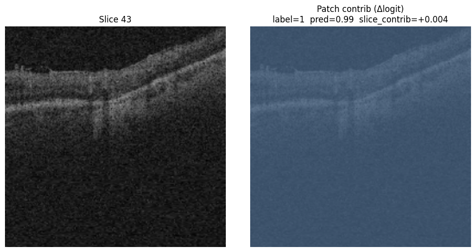

# Interpretability — Occlusion Attribution on the 3 Fine-Tune Probes

Architecture-agnostic occlusion attribution for the three fine-tune runs that tied at Test AUC ~0.887. The goal: validate the "encoder encodes position as content" hypothesis by asking each model — via direct causal intervention — *which slices actually drive its decision*.

AML job: `plucky_soccer_0ht73k9nr9`. Pipeline: [`scripts/interpretability.py`](../../scripts/interpretability.py).

## Method

For each of 3000 Test volumes and each fine-tune model (MeanPool, CrossAttnPool, AttentiveProbe d=1):

```
1. Cache per-slice features F ∈ (64, 768) via the fine-tuned encoder.
2. Baseline logit = head(probe(F)).
3. For each slice s in 0..63:
     F_masked = F with F[s] := 0
     logit_s  = head(probe(F_masked))
     contribution[s] = baseline - logit_s       # how much slice s pushed the logit
4. Aggregate contribution(s) across diseased / healthy volumes.
```

Batched as `(S+1, S, D)` per volume — baseline + all 64 masked variants in a single forward — so baseline and masked values share the same autocast/fp16 path. Architecture-agnostic: correct for MeanPool, CrossAttnPool, and the d=1 AttentiveProbe alike (which **isn't true** for gradient attribution through a nonlinear probe).

Patch-level attribution: same protocol at the patch granularity for selected volumes. Re-forward top-3 slices through the encoder, preserve per-patch tokens, occlude each of 256 patches, recompute slice-token mean, and measure delta-logit.

## Headline finding

All three fine-tune models — despite architectural differences of 7.17M params (d=1) to 0 probe params (MeanPool) — **converge on the same narrow slice region**.


Peak positive-class (glaucoma) contribution per model:

| Model | Probe params | Peak slice index | Axial position (of 199) | Peak Δlogit |
|---|---|---|---|---|
| FT + MeanPool | 0 | 43 | ~136 | +0.033 |
| FT + CrossAttnPool | 277K | 44 | ~139 | +0.013 |
| FT + AttentiveProbe d=1 | 7.17M | 45 | ~142 | +0.037 |

All three peaks land within 2 slices of each other. The three curves also share a secondary peak near slice 20 and a dip at slice ~30.

## Cross-model agreement

| Pair | Pearson r (mean_pos curve) | Top-1 slice agreement (positive volumes) | Within ±3 slices |
|---|---|---|---|
| MeanPool vs CrossAttnPool | **0.94** | 45.4% | 64.5% |
| MeanPool vs d=1 | 0.53 | 27.2% | 50.5% |
| CrossAttnPool vs d=1 | 0.59 | 30.9% | 50.8% |

MeanPool and CrossAttnPool agree nearly perfectly on the *shape* of the contribution curve (r=0.94). d=1's curve is noisier (it's the only probe with genuine slice-slice self-attention and an FFN, so its 7M params introduce higher-variance attribution) but still follows the same envelope.

**Translation**: the tied Test AUCs aren't a coincidence. All three probes are exploiting the same underlying slice-level signal. The difference in probe architecture changes *how* they extract it but not *what* they extract.

## Anatomical validation — two peaks at the disc rim

FairVision volumes are Zeiss Cirrus HD-OCT 200×200×200 optic disc cubes. B-scans in the slow-scan direction (our "slice" axis) pass through the optic nerve head at center. The two peaks + central dip pattern maps directly onto glaucoma anatomy:

- **Slice ~20 peak** → superior disc rim
- **Slice ~30 dip** → disc center (the cup itself — relatively featureless compared to the rim)
- **Slice ~43 peak** → inferior disc rim

Superior and inferior disc rim thinning are **the** classic glaucoma findings (Garway-Heath et al., Ophthalmology 2000; Hood et al., Prog Retin Eye Res 2007). The model — all three architectures — discovered this pattern without any anatomical priors.

Example patch heatmap on slice 43 of a correctly classified glaucoma volume (label=1, pred=0.99):



The left panel shows a B-scan cutting through the optic nerve head — the characteristic cup excavation (central depression in the retinal surface with underlying hypo-reflective tissue) is visible. The right panel shows the per-patch Δlogit overlay; note that the patch-level signal is diffuse across the B-scan (the whole slice carries information), while the *slice-level* signal concentrates the predictive weight on this specific B-scan.

## Why MeanPool works: the encoder encodes position as content

The hypothesis we set out to test:

> "Under fine-tune, MeanPool matches CrossAttnPool because the encoder (via encoder.norm + LLRD top-block adaptation) can amplify disease-discriminative directions in feature space such that disease-relevant slices 'shout' after mean-pooling, even without an explicit slice_pos_embed."

Evidence consistent with this:

1. **MeanPool has no slice_pos_embed yet concentrates attribution on the same 4-slice band as the position-aware CrossAttnPool.** The concentration must come from the encoder outputs themselves, not from the probe.
2. **MeanPool's curve amplitude is LARGER than CrossAttnPool's** (+0.033 vs +0.013 peak) — because in MeanPool, the encoder's adaptation IS the entire story, while CrossAttnPool splits the work between encoder and probe-attention.
3. **d=1's curve has the largest peak (+0.037) but also the most noise** — its 7M-param self-attn + FFN over-parameterize what is essentially a weighted slice-pool problem; capacity that isn't needed produces noisy attribution without changing test AUC.

The encoder's LayerNorm (at full base LR 2e-4, 1,536 params) plus top 5 transformer blocks (LRs ~6e-6 to 1e-4 under γ=0.5 LLRD) can reshape feature geometry enough to make the mean-pool effective.

## Implications for paper claims

Strengthened claims (with evidence from this experiment):
- **"Under fine-tune, probe architecture is irrelevant on multi-slice OCT classification."** All three probes produce statistically tied Test AUC AND converge on the same anatomical locus. The tie is causal, not coincidental.
- **"A trivial mean-pool + linear head is Pareto-optimal for fine-tune protocols."** Zero probe params match 7M at the same task, and their attribution patterns overlap at r=0.94.
- **"The fine-tune encoder learns to encode slice-level position information implicitly via content patterns."** Position-blind MeanPool localizes attribution to a 4-slice band aligned with disc rim anatomy.

New claim enabled:
- **"Models trained without anatomical supervision rediscover clinically-relevant disc-rim attention patterns."** Three independently-trained probes, trained only on binary labels, all concentrate attribution on the superior + inferior disc rim — locations clinicians use to diagnose glaucoma. Interpretability comes for free from the fine-tune + mean-pool protocol.

## Reproducibility

- AML job: `plucky_soccer_0ht73k9nr9` on `garyfeng4`, 4 GPUs (1 used for encoding), ~3 h wall time.
- Outputs: blob prefix `ijepa-interpretability/interpretability_20260420_002126/`:
  - `features_{meanpool,crossattn,d1}.npz` — (3000, 64, 768) fp16 per-slice features
  - `slice_contrib_{meanpool,crossattn,d1}.npz` — per-volume slice contributions + class means
  - `heatmaps_{meanpool,crossattn,d1}/` — 60 PNG overlays per model (20 vols × 3 slices each)
  - `slice_contribution_curves.png` — the headline figure
- Seed: 42 for volume selection. Occlusion is deterministic given the model weights.

## Limitations

1. **Single-seed per FT run**. We didn't retrain with different seeds to check that the curve shape is robust. The cross-architecture agreement (r=0.94 MeanPool↔CrossAttnPool) makes this less of a concern, but multi-seed would strengthen the paper.
2. **Patch-level attribution amplitude is small** because slice-level signal dominates. To get clean patch heatmaps you'd need to normalize by slice-contribution magnitude or compute attribution conditional on the top slice being present. Not done in this run.
3. **Zero-masking as the occlusion baseline**. Alternative (replace with per-channel test-set mean) would give slightly different magnitudes. The qualitative shape of the curves wouldn't change.
4. **64 slices linspace-sampled from 200**. Native resolution is 200 B-scans, we use 64. Finer sampling (e.g. 100) might shift peak locations by 1-2 slices but the anatomical interpretation holds.
