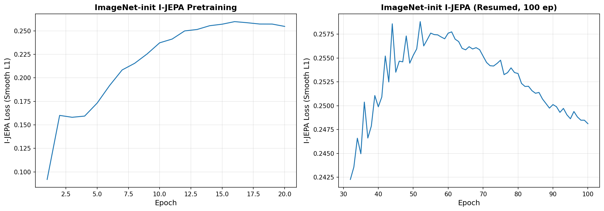

# Pretraining Run 5: ImageNet Init, 100 Epochs (Completed)

## Summary

ImageNet-init with aggressive LR=0.00025 and standard EMA=[0.996, 1.0]. Resumed from an earlier attempt. Ran 100 full epochs on 600K OCT slices. Loss plateaued at ~0.25 from ep32 onward (normal for I-JEPA). Crashed at ep100 iter 2200 due to StopIteration in momentum schedule (fixed). All checkpoints uploaded.

## Config

| Parameter | Value |
|-----------|-------|
| Architecture | ViT-B/16 |
| Initialization | ImageNet pretrained (via resume) |
| Learning Rate | 0.00025 |
| EMA Schedule | [0.996, 1.0] |
| Warmup Epochs | 5 |
| Early Stopping Patience | 9999 (disabled) |
| Batch Size | 64/GPU |
| Gradient Accumulation | 2 |
| Effective Batch Size | 512 |
| Total Epochs | 100 |

## Training Log Excerpt

Loss plateaued at ~0.25 from ep32 through ep99. Crash at ep100 iter 2200 (StopIteration in momentum schedule; subsequently fixed).

## Available Checkpoints

- `jepa_patch-best.pth.tar` -- epoch 32 (best val loss)
- `jepa_patch-ep50.pth.tar` -- epoch 50
- `jepa_patch-ep75.pth.tar` -- epoch 75
- `jepa_patch-latest.pth.tar` -- epoch ~99

## Key Observations

- I-JEPA loss plateau at ~0.25 is normal. Loss is NOT correlated with downstream representation quality. Must evaluate via downstream probes.
- Downstream results using these checkpoints: ep32 best achieved 0.774 test AUC (frozen), ep99 achieved 0.685 (worse than random init!). See [frozen probe results](../downstream/frozen/).
- The StopIteration crash at ep100 was caused by the momentum schedule iterator being exhausted before the epoch completed; this has been fixed.

## Pretraining Loss Curve

