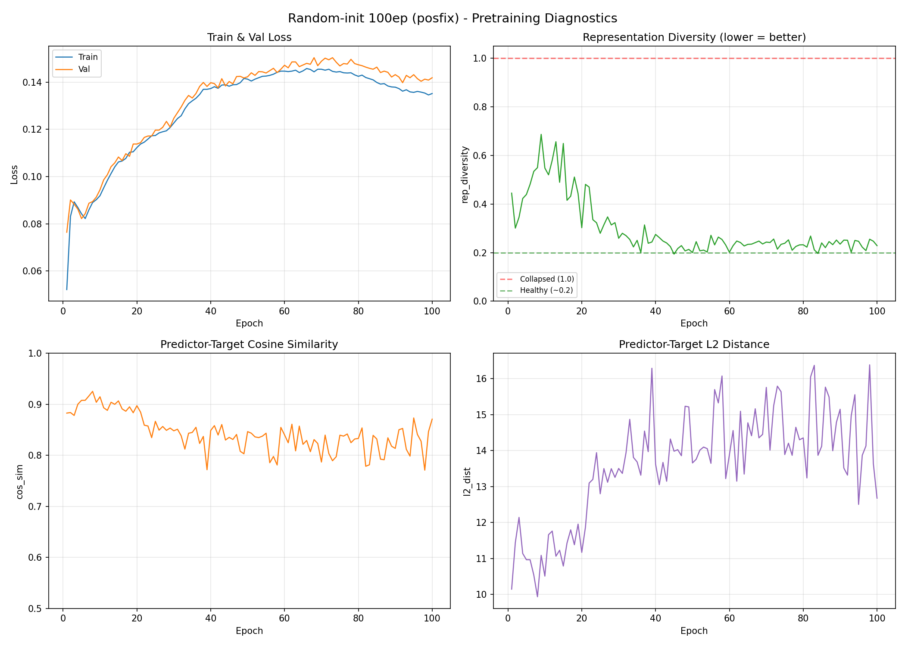
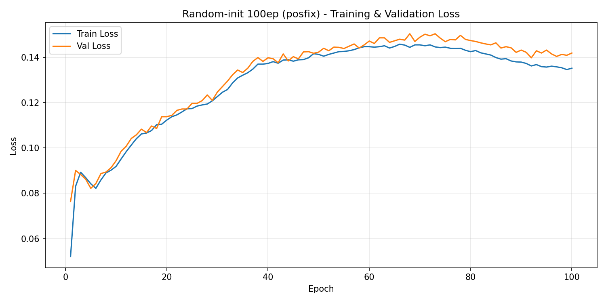
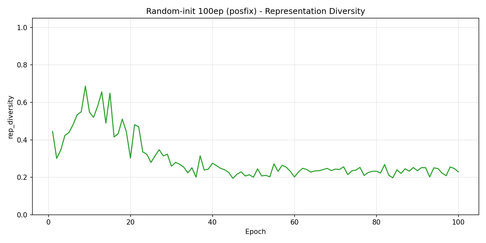
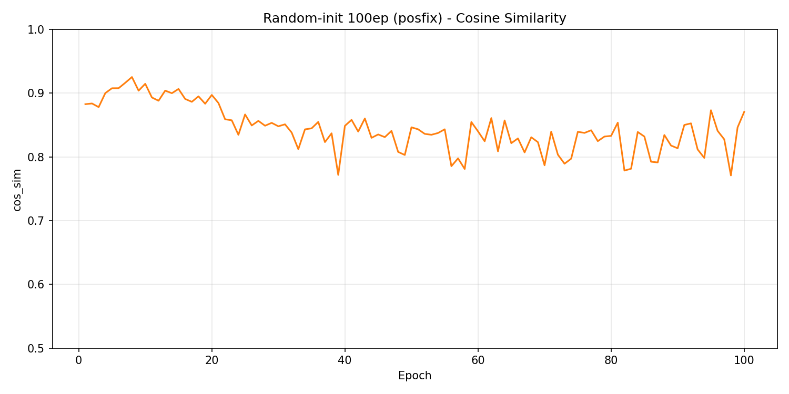

# Pretraining Run 6: Random-init 100ep (posfix)

First run with corrected 2D sinusoidal positional embeddings. Random initialization, 100 epochs, no early stopping. **Completed** — all checkpoints uploaded.

## Config

| Parameter | Value |
|-----------|-------|
| Architecture | ViT-B/16 |
| Initialization | Random |
| Learning Rate | 0.00025 (cosine decay to 1e-6) |
| Start LR | 0.0001 |
| EMA Schedule | [0.996, 1.0] cosine |
| Warmup Epochs | 5 |
| Weight Decay | 0.04 → 0.4 (cosine) |
| Batch Size | 64/GPU × 4 GPUs × 2 accum = 512 effective |
| Patience | 999 (disabled) |
| Total Epochs | 100 |
| Blob prefix | `ijepa-results/patch_vit_base_ps16_ep100_bs64_lr0.00025_20260411_063607` |

## Diagnostic Plots

### Individual Plots

| Plot | Description |
|------|-------------|
|  | Train & val loss. Monotonically increases — expected I-JEPA behavior as EMA target learns harder representations. |
|  | Representation diversity. Stable at 0.20-0.27 throughout training (healthy). |
|  | Predictor-target cosine similarity. Stable at 0.78-0.87 (healthy predictor tracking). |

## Training Summary

| Epoch | train_loss | val_loss | cos_sim | rep_div | EMA |
|-------|-----------|----------|---------|---------|-----|
| 1 | 0.0521 | 0.0764 | 0.883 | 0.445 | 0.996 |
| 5 | 0.0842 | 0.0822 | 0.908 | 0.439 | 0.996 |
| 10 | 0.0919 | 0.0944 | 0.915 | 0.548 | 0.996 |
| 25 | 0.1174 | 0.1197 | 0.867 | 0.279 | 0.997 |
| 50 | 0.1413 | 0.1423 | 0.846 | 0.200 | 0.998 |
| 75 | 0.1445 | 0.1469 | 0.839 | 0.238 | 0.999 |
| 88 | 0.1384 | 0.1442 | 0.834 | 0.233 | 0.999 |
| 92 | 0.1362 | 0.1398 | 0.853 | 0.251 | 0.999 |
| 95 | 0.1357 | 0.1432 | 0.873 | 0.247 | 1.000 |
| 96 | 0.1361 | 0.1415 | 0.841 | 0.222 | 1.000 |
| 100 | 0.1352 | 0.1419 | 0.871 | 0.229 | 1.000 |

## Available Checkpoints

| Checkpoint | Epoch | Blob path |
|-----------|-------|-----------|
| `jepa_patch-best.pth.tar` | 1 (BUG: should be gated on past_warmup) | uploaded |
| `jepa_patch-ep25.pth.tar` | 25 | uploaded |
| `jepa_patch-ep50.pth.tar` | 50 | uploaded |
| `jepa_patch-ep75.pth.tar` | 75 | uploaded |
| `jepa_patch-ep100.pth.tar` | 100 | uploaded |

## Known Issues

- **Best checkpoint bug**: `jepa_patch-best.pth.tar` is epoch 1 (val_loss=0.0764), which is the artificially low pre-warmup loss. The `past_warmup` guard only protects patience counting, not best checkpoint saving. Fix needed for future runs.

## Key Observations

- **Healthy diagnostics throughout**: rep_diversity stable 0.20-0.27, cos_sim stable 0.78-0.87. No collapse, no divergence.
- **Loss increase is expected**: I-JEPA loss increases as EMA target learns harder representations. Train loss decreased in late epochs (0.1445→0.1357) while val loss remained in 0.14-0.15 range.
- **Position encoding working**: Unlike pre-posfix runs, this run shows healthy rep_diversity from epoch 1 (~0.45, dropping to ~0.2 by ep25). Pre-posfix runs had rep_diversity 0.5-0.7 throughout.
- **Downstream evaluation in progress**: Linear probe sweep (ep25/50/75/100, 4 GPUs parallel) submitted as `dreamy_basin_6rxm9myg2g`.
